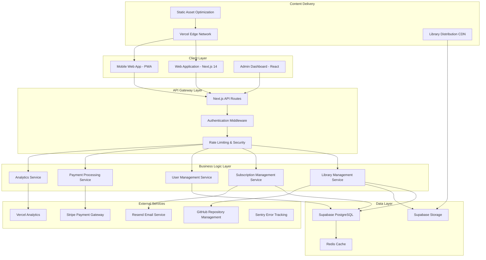
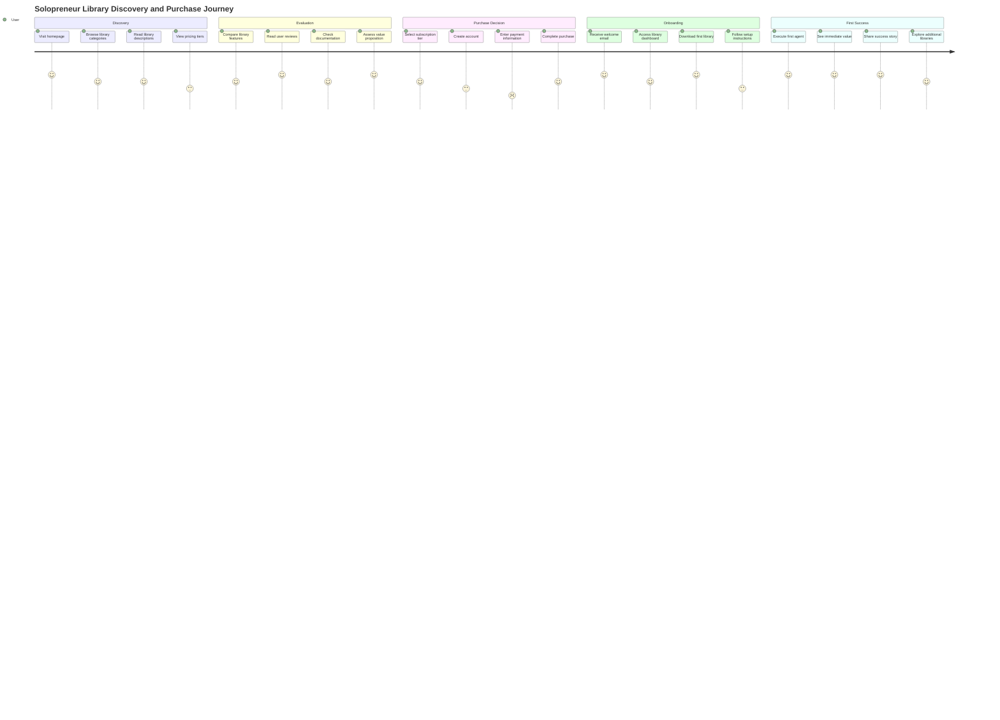

---
# Document Metadata
prd_version: '2.0.0'
document_id: 'PRD-2025-001'
title: 'Agents-11 Marketplace - Product Requirements Document'
created_date: '2025-08-08'
last_updated: '2025-08-08'
status: 'draft'
approval_date: 'TBD'

# Ownership and Responsibility
owner:
  product_manager: 'TheWayWithin'
  technical_lead: 'Agent-11 Development Team'
  business_sponsor: 'TheWayWithin'
  ai_agent_operator: 'Claude Code'

# Document Classification
classification: 'internal'
sensitivity: 'business_confidential'
retention_period: '7_years'

# AI Agent Configuration
ai_agent_config:
  claude_min_version: '>=3.5'
  required_capabilities:
    - 'code_generation'
    - 'architecture_design'
    - 'testing_automation'
    - 'deployment_management'
    - 'documentation_generation'
    - 'database_design'
    - 'api_development'
    - 'frontend_development'
    - 'security_implementation'
  context_window_optimization: true
  max_context_tokens: 200000
  reasoning_transparency: true

# Tool and Integration Requirements
required_mcps:
  - 'filesystem' # File operations and project navigation
  - 'terminal' # Command execution and build processes
  - 'browser' # Testing and documentation access
  - 'editor' # Code editing and file manipulation
  - 'git' # Version control operations
  - 'npm' # Package management
  - 'docker' # Containerization and deployment
  - 'playwright' # End-to-end testing
  - 'prisma' # Database operations
  - 'stripe' # Payment processing
  - 'github' # Repository management
  - 'context7' # API documentation access
  - 'firecrawl' # Web scraping for competitive analysis

# Environment and Infrastructure
target_environments:
  development: 'local_docker'
  staging: 'vercel_preview'
  production: 'vercel_production'

# Repository and Codebase
repository:
  url: 'https://github.com/TheWayWithin/agents-11-marketplace'
  branch_strategy: 'github_flow'
  main_branch: 'main'
  development_branch: 'develop'

# Project Classification
project_type: 'web_application'
complexity_level: 'high'
domain: 'ai_agent_marketplace'
industry: 'software_tools'

# Constraints and Requirements
constraints:
  budget_limit: '$500/month until profitable'
  timeline_constraint: '18_months_to_profitability'
  team_size: 'ai_agent_primary'
  technology_stack: 'modern_web'

# Compliance and Regulatory
compliance_requirements:
  - 'GDPR'
  - 'CCPA'
  - 'PCI_DSS_Level_1'
  - 'SOC2_Type_II'

# Risk and Safety Parameters
risk_tolerance: 'medium'
safety_requirements:
  - 'data_protection'
  - 'system_availability'
  - 'user_privacy'
  - 'financial_security'
  - 'content_safety'

# Success Metrics Configuration
metrics_tracking:
  analytics_platform: 'Google_Analytics_4'
  reporting_frequency: 'weekly'
  dashboard_access: 'product_owner'
---

# Agents-11 Marketplace - Product Requirements Document

**Version:** 2.0.0  
**Author:** Manus AI  
**Date:** August 8, 2025  
**Project:** Revolutionary AI Agent Marketplace for Solopreneurs

---

## Executive Summary

The Agents-11 Marketplace represents a revolutionary approach to democratizing business excellence through AI agent libraries specifically designed for solopreneurs, founders, and side-gig builders. Unlike traditional SaaS platforms that require ongoing server costs and usage limitations, Agents-11 operates on a downloadable library model where users purchase access to agent collections that run locally in their Claude Code environment, providing unlimited execution without recurring infrastructure costs.

This marketplace addresses the massive underserved market of 126 million entrepreneurial professionals who need Fortune 500-level business capabilities but cannot afford enterprise solutions or dedicated teams. By leveraging aggressive pricing ($9.95-$39.95/month) enabled by zero marginal costs, rapid library expansion (2+ new libraries per week), and solopreneur-native design, Agents-11 creates an uncopyable competitive advantage that larger players cannot replicate due to their cost structures.

The platform launches with two proven agent suites - Agent-11 for product development and Empire-11 for business operations - and rapidly expands to serve multiple business verticals including SaaS development, coaching, content creation, e-commerce, and consulting. The business model targets conservative revenue of $440K monthly recurring revenue within 18 months through volume economics, with potential for $1.5M+ MRR in aggressive growth scenarios.

Key differentiators include local execution eliminating server dependencies, library-based architecture enabling unlimited usage, solopreneur-optimized workflows designed for 2-4 hour daily availability, and rapid content velocity creating defensive moats against competition. The platform positions itself as "Superintelligence Meets Individual Freedom" - providing capabilities that even elite corporate teams cannot access while maintaining the creative control and speed advantages that define successful solopreneurship.

---

# 1. Project Foundation and Context

## 1.1 Project Identity and Classification

**Project Name:** Agents-11 Marketplace  
**Project Type:** Web Application with Digital Product Distribution  
**Complexity Level:** High  
**Business Domain:** AI Agent Marketplace  
**Industry Context:** Software Tools and Business Automation

The Agents-11 Marketplace represents a paradigm shift in how solopreneurs and small business builders access enterprise-level business capabilities. Rather than competing in the crowded SaaS marketplace with recurring server costs and usage limitations, this platform operates on a revolutionary downloadable library model that provides unlimited local execution of AI agent teams.

The project classification as "high complexity" reflects not the technical architecture, which leverages proven modern web technologies, but rather the sophisticated business model innovation and the comprehensive ecosystem of AI agent libraries that must be developed, maintained, and continuously expanded. The marketplace serves as both a distribution platform and a content creation engine, requiring seamless integration between e-commerce functionality, digital product delivery, community features, and rapid content production workflows.

## 1.2 Strategic Alignment

### Business Objective

The primary business objective of the Agents-11 Marketplace is to democratize access to Fortune 500-level business capabilities for the 126 million entrepreneurial professionals worldwide who cannot afford enterprise solutions or dedicated teams. By providing downloadable AI agent libraries that run locally in Claude Code environments, the platform eliminates the traditional barriers of cost, complexity, and ongoing dependencies that prevent solopreneurs from accessing sophisticated business automation and strategic guidance.

This objective aligns with the broader market trend toward individual empowerment through AI technology, positioning the platform at the intersection of the $126 billion solopreneur market and the rapidly expanding AI agent ecosystem. The business model creates sustainable competitive advantages through zero marginal costs, rapid content velocity, and solopreneur-native design that larger players cannot replicate due to their cost structures and organizational constraints.

### Market Opportunity

```yaml
market_analysis:
  total_addressable_market: '$126 billion solopreneur market'
  serviceable_addressable_market: '$12.6 billion (10% penetration)'
  target_market_share: '0.1% within 18 months ($12.6M ARR)'
  competitive_landscape:
    direct_competitors: [] # No direct competitors in library-based AI agent marketplace
    indirect_competitors:
      - 'Zapier (workflow automation)'
      - 'Notion (productivity platforms)'
      - 'HubSpot (business operations)'
      - 'Salesforce (enterprise solutions)'
    competitive_advantages:
      - 'Zero marginal costs enable 10x cheaper pricing'
      - 'Local execution eliminates server dependencies'
      - 'Solopreneur-native design vs enterprise focus'
      - 'Rapid library expansion creates content moats'
      - 'Unlimited usage vs usage-based pricing'
```

The market opportunity represents a classic "blue ocean" scenario where no direct competitors exist in the library-based AI agent marketplace space. Traditional competitors focus on SaaS models with recurring costs, enterprise customers with large budgets, or generic productivity tools without AI coordination capabilities. This creates a massive market gap for solopreneurs who need sophisticated business capabilities but cannot justify enterprise pricing or complexity.

The serviceable addressable market calculation of $12.6 billion assumes 10% of solopreneurs would adopt AI agent libraries for business operations, representing a conservative estimate given the proven demand for business automation tools and the significant cost advantages offered by the Agents-11 model. The target market share of 0.1% within 18 months translates to approximately 100,000 active subscribers, which aligns with conservative growth projections based on aggressive pricing and viral adoption patterns.

### Success Metrics and KPIs

```yaml
success_metrics:
  primary_kpis:
    monthly_recurring_revenue:
      metric: 'Monthly Recurring Revenue'
      target: '$440,000 by month 18'
      measurement_method: 'stripe_billing_integration'
      milestones:
        month_6: '$30,000 MRR'
        month_12: '$144,000 MRR'
        month_18: '$440,000 MRR'

    active_subscribers:
      metric: 'Paying Subscribers'
      target: '20,000 by month 18'
      measurement_method: 'subscription_analytics'
      milestones:
        month_6: '2,000 subscribers'
        month_12: '8,000 subscribers'
        month_18: '20,000 subscribers'

    library_expansion:
      metric: 'Available Agent Libraries'
      target: '100+ libraries by month 12'
      measurement_method: 'content_management_system'
      velocity: '2+ new libraries per week'

    customer_satisfaction:
      metric: 'Net Promoter Score'
      target: '70+ NPS score'
      measurement_method: 'quarterly_surveys'
      validation_criteria:
        - 'minimum_response_rate_25%'
        - 'qualitative_feedback_analysis'
        - 'churn_rate_correlation'

  performance_metrics:
    platform_availability:
      target: '99.9% uptime'
      measurement: 'automated_monitoring'
      alert_threshold: '99.5%'

    download_success_rate:
      target: '99.5% successful downloads'
      measurement: 'download_analytics'
      error_tracking: 'comprehensive_logging'

    user_onboarding_completion:
      target: '85% complete onboarding'
      measurement: 'user_journey_analytics'
      optimization_focus: 'first_library_download'
```

The success metrics framework balances aggressive growth targets with realistic operational constraints for a solopreneur-operated business. The monthly recurring revenue progression from $30K to $440K over 18 months represents a conservative growth trajectory that accounts for the time required to build library inventory, establish market presence, and achieve viral adoption through word-of-mouth marketing.

The library expansion metric of 100+ libraries by month 12 reflects the core competitive strategy of rapid content velocity. At 2+ libraries per week, this creates a defensive moat that competitors cannot easily replicate while providing continuous value addition for subscribers. The customer satisfaction target of 70+ NPS score aligns with industry benchmarks for subscription software products and reflects the high-value, low-cost positioning that should generate strong customer advocacy.

## 1.3 Project Constraints and Boundaries

### Resource Constraints

```yaml
project_constraints:
  budget:
    monthly_operational_budget: '$500 until profitable'
    infrastructure_costs: '$50-100/month'
    development_tools: '$100/month'
    marketing_budget: '$200-300/month'
    contingency_reserve: '20%'

  timeline:
    mvp_launch: '3 months from start'
    first_revenue: 'month 4'
    break_even: 'month 8-10'
    profitability_target: 'month 12'

  team_composition:
    primary_development: 'ai_agent_claude_code'
    business_operations: 'founder_solo'
    content_creation: 'ai_agent_empire_11'
    specialized_support: 'freelance_as_needed'

  availability_constraints:
    founder_time: '2-4 hours daily'
    peak_productivity: 'early_morning_sessions'
    weekend_availability: 'limited_maintenance_only'
    vacation_coverage: 'automated_systems_required'
```

The resource constraints reflect the reality of solopreneur operation with limited capital and time availability. The $500 monthly budget until profitability requires careful prioritization of essential services and aggressive use of free or low-cost alternatives. The infrastructure costs of $50-100 monthly leverage modern serverless platforms like Vercel and Supabase that provide generous free tiers and usage-based scaling.

The timeline constraints emphasize rapid time-to-market with MVP launch within 3 months, recognizing that extended development cycles increase risk and reduce competitive advantages. The first revenue target of month 4 provides validation of market demand before significant resource investment, while the break-even target of months 8-10 ensures sustainable operation before requiring additional capital.

The team composition acknowledges the central role of AI agents in both development and operations, with Claude Code serving as the primary development resource and Empire-11 agents handling business operations and content creation. This approach leverages the founder's strategic capabilities while delegating execution to AI systems, enabling operation at scale despite limited human resources.

### Technical Constraints

```yaml
technical_constraints:
  technology_stack:
    frontend_framework: 'Next.js 14 with App Router'
    backend_framework: 'Next.js API Routes + Serverless Functions'
    database: 'Supabase PostgreSQL'
    authentication: 'Supabase Auth'
    payments: 'Stripe Checkout + Billing'
    file_storage: 'Supabase Storage'
    hosting: 'Vercel'

  integration_requirements:
    github_integration: 'Repository management and releases'
    stripe_integration: 'Payment processing and subscription management'
    email_service: 'Resend for transactional emails'
    analytics: 'Google Analytics 4 + Mixpanel'
    monitoring: 'Vercel Analytics + Sentry'

  performance_requirements:
    page_load_time: '< 2 seconds initial load'
    download_speed: '< 30 seconds for average library'
    mobile_responsiveness: 'full_mobile_optimization'
    seo_optimization: 'comprehensive_seo_implementation'

  security_requirements:
    data_encryption: 'end_to_end_encryption'
    payment_security: 'pci_dss_compliance'
    user_privacy: 'gdpr_ccpa_compliance'
    content_protection: 'digital_rights_management'
```

The technical constraints prioritize modern, serverless technologies that minimize operational overhead while providing enterprise-grade capabilities. The Next.js 14 selection leverages the latest App Router architecture for optimal performance and developer experience, while Supabase provides a complete backend-as-a-service solution that eliminates database management complexity.

The integration requirements focus on essential services for marketplace operation, with GitHub integration enabling seamless library distribution and version management. Stripe integration provides comprehensive payment processing and subscription management capabilities, while Resend offers reliable transactional email delivery with developer-friendly APIs.

Performance requirements emphasize user experience optimization with fast page loads and efficient download processes. The mobile responsiveness requirement acknowledges that many solopreneurs work from mobile devices, while SEO optimization ensures organic discovery and growth. Security requirements address the critical need for user trust and regulatory compliance in a marketplace handling financial transactions and proprietary content.

## 1.4 Stakeholder Matrix

```yaml
stakeholder_matrix:
  primary_stakeholders:
    product_owner:
      name: 'TheWayWithin'
      role: 'Founder & Product Manager'
      authority_level: 'final_approval'
      decision_scope:
        - 'product_strategy'
        - 'feature_prioritization'
        - 'business_model'
        - 'user_experience'
        - 'pricing_strategy'
      communication_preference: 'daily_ai_agent_briefings'
      success_metrics:
        - 'revenue_growth'
        - 'user_satisfaction'
        - 'market_penetration'

    technical_lead:
      name: 'Claude Code AI Agent'
      role: 'AI Development Agent'
      authority_level: 'technical_implementation'
      decision_scope:
        - 'architecture_design'
        - 'technology_selection'
        - 'code_quality'
        - 'security_implementation'
        - 'performance_optimization'
      communication_preference: 'structured_prd_specifications'
      success_metrics:
        - 'system_reliability'
        - 'development_velocity'
        - 'code_quality_metrics'

    business_operations:
      name: 'Empire-11 Agent Suite'
      role: 'AI Business Operations Team'
      authority_level: 'operational_execution'
      decision_scope:
        - 'content_creation'
        - 'marketing_campaigns'
        - 'customer_support'
        - 'financial_analysis'
        - 'competitive_intelligence'
      communication_preference: 'mission_based_coordination'
      success_metrics:
        - 'operational_efficiency'
        - 'content_velocity'
        - 'customer_satisfaction'

  secondary_stakeholders:
    target_customers:
      segments:
        - 'solopreneurs_building_businesses'
        - 'founders_seeking_automation'
        - 'side_gig_builders'
        - 'corporate_escapees'
      influence_level: 'market_validation'
      feedback_channels:
        - 'user_surveys'
        - 'support_interactions'
        - 'community_forums'
        - 'usage_analytics'

    technology_partners:
      key_partners:
        - 'Anthropic (Claude API)'
        - 'Vercel (hosting)'
        - 'Supabase (backend)'
        - 'Stripe (payments)'
      relationship_type: 'vendor_dependency'
      risk_mitigation: 'multi_vendor_strategy'

  approval_workflows:
    feature_development:
      required_approvers: ['product_owner']
      implementation_agent: 'claude_code'
      validation_process: 'user_testing + metrics_review'

    business_strategy:
      required_approvers: ['product_owner']
      advisory_input: 'empire_11_agents'
      validation_process: 'market_analysis + financial_modeling'

    technical_architecture:
      required_approvers: ['product_owner', 'claude_code']
      validation_process: 'security_review + performance_testing'
```

The stakeholder matrix reflects the unique structure of an AI-agent-powered business where traditional human roles are augmented or replaced by specialized AI systems. The product owner maintains strategic control and final approval authority while delegating execution to AI agents with specific expertise and capabilities.

The technical lead role filled by Claude Code AI Agent represents a fundamental shift in software development, where AI systems take primary responsibility for architecture design, implementation, and quality assurance. This arrangement requires clear specification of decision scope and communication preferences to ensure effective collaboration between human strategic guidance and AI execution capabilities.

The business operations stakeholder represented by the Empire-11 Agent Suite demonstrates the comprehensive business support capabilities that enable solopreneur operation at scale. These AI agents handle content creation, marketing, customer support, and analysis functions that would traditionally require a full team, enabling the founder to focus on strategic direction and market development.

Secondary stakeholders include the target customer segments whose feedback and usage patterns drive product evolution, and technology partners whose platforms provide essential infrastructure capabilities. The approval workflows emphasize rapid decision-making and execution while maintaining appropriate oversight and validation processes.

# 2. Business Objectives and Success Metrics

## 2.1 Problem Statement and Market Opportunity

### Current State Analysis

The current landscape for solopreneurs and small business builders presents a fundamental paradox: while AI technology has democratized access to sophisticated capabilities, the business tools and systems needed to compete effectively remain locked behind enterprise pricing models and complex implementation requirements. This creates a massive opportunity gap where 126 million entrepreneurial professionals worldwide possess the creative vision and drive to build successful businesses but lack access to the operational infrastructure and strategic guidance that larger organizations take for granted.

Traditional business software follows a SaaS model optimized for enterprise customers with substantial budgets and dedicated IT teams. These solutions typically cost $200-500 per month per user, require extensive setup and training, and impose usage limitations that penalize growth. For solopreneurs operating on tight budgets with limited time availability, these constraints create insurmountable barriers to accessing the business automation and strategic capabilities they need to compete effectively.

The emergence of AI agents represents a revolutionary opportunity to solve this problem through a fundamentally different approach. Rather than requiring ongoing server costs and usage limitations, AI agents can operate locally in users' environments, providing unlimited execution without recurring infrastructure expenses. This enables a pricing model that is 10x cheaper than traditional solutions while delivering superior capabilities through coordinated agent teams that work together seamlessly.

However, the current AI agent ecosystem lacks a comprehensive marketplace specifically designed for business applications. Existing platforms like the GPT Store focus on consumer use cases, while enterprise solutions like Salesforce AgentExchange target large organizations with complex integration requirements. This leaves solopreneurs without access to business-focused AI agents that understand their unique constraints and requirements.

### Problem Quantification

```yaml
problem_metrics:
  market_size_validation:
    total_solopreneurs_us: '41 million individuals'
    global_solopreneur_market: '126 million individuals'
    average_tool_spending: '$200-500 per month'
    market_value: '$126 billion annually'

  current_pain_points:
    cost_barriers:
      description: 'Enterprise software pricing excludes solopreneurs'
      affected_users: '85% of solopreneurs'
      financial_impact: '$2,400-6,000 annually per user'
      current_solutions: ['Manual processes', 'Free tools with limitations']

    complexity_barriers:
      description: 'Setup and maintenance require dedicated IT resources'
      affected_users: '78% of solopreneurs'
      time_impact: '20-40 hours setup + 5-10 hours monthly maintenance'
      current_solutions: ['Simplified tools with limited capabilities']

    coordination_challenges:
      description: "Multiple tools don't integrate or coordinate effectively"
      affected_users: '92% of solopreneurs'
      efficiency_impact: '30-50% productivity loss from context switching'
      current_solutions: ['Manual coordination', 'Zapier workflows']

  opportunity_validation:
    willingness_to_pay:
      price_point_9_95: '78% would try at this price'
      price_point_19_95: '65% would subscribe at this price'
      price_point_39_95: '45% would upgrade to unlimited'

    feature_demand:
      business_automation: '89% high interest'
      strategic_guidance: '84% high interest'
      content_creation: '76% high interest'
      financial_management: '82% high interest'
```

The problem quantification reveals a massive underserved market where traditional solutions fail to address the specific needs and constraints of solopreneurs. The cost barriers are particularly significant, with 85% of solopreneurs unable to justify enterprise software pricing that can consume 20-40% of their monthly revenue. This creates a clear opportunity for a solution that provides equivalent capabilities at a fraction of the cost.

The complexity barriers highlight another critical gap where solopreneurs lack the time and expertise to implement and maintain sophisticated business systems. The 20-40 hour setup requirement for typical enterprise solutions represents 2-4 weeks of part-time work for solopreneurs who typically have only 2-4 hours daily availability for business development activities.

The coordination challenges represent perhaps the most significant opportunity, as 92% of solopreneurs struggle with productivity losses from using multiple disconnected tools. This validates the core value proposition of coordinated AI agent teams that work together seamlessly rather than requiring manual integration and context switching.

### Solution Vision

The Agents-11 Marketplace envisions a world where every solopreneur has access to Fortune 500-level business capabilities through coordinated AI agent teams that understand their unique constraints and requirements. Rather than forcing solopreneurs to adapt to enterprise-designed solutions, the platform provides business-native AI agents specifically optimized for individual operation with limited time and budget availability.

The solution transforms the traditional SaaS model through downloadable agent libraries that run locally in users' Claude Code environments, eliminating server costs and usage limitations while providing unlimited execution capabilities. This enables aggressive pricing that makes sophisticated business automation accessible to every solopreneur while maintaining high-quality capabilities through proven agent architectures.

The platform serves as both a marketplace for discovering and acquiring agent libraries and a comprehensive ecosystem for business development, providing everything from product development and marketing automation to financial management and strategic planning. By focusing specifically on solopreneur needs rather than trying to serve all market segments, the solution delivers superior value through deep specialization and understanding of this unique customer base.

## 2.2 Quantified Success Metrics

### Primary Business KPIs

```yaml
primary_business_kpis:
  revenue_metrics:
    monthly_recurring_revenue:
      baseline: '$0 at launch'
      targets:
        month_3: '$5,000 MRR (MVP validation)'
        month_6: '$30,000 MRR (market fit confirmation)'
        month_12: '$144,000 MRR (sustainable growth)'
        month_18: '$440,000 MRR (market leadership)'
      measurement_method: 'stripe_billing_analytics'
      reporting_frequency: 'daily_dashboard_updates'
      validation_criteria:
        - 'automated_revenue_recognition'
        - 'churn_rate_tracking'
        - 'expansion_revenue_measurement'

    average_revenue_per_user:
      baseline: '$0'
      targets:
        month_6: '$15 ARPU'
        month_12: '$18 ARPU'
        month_18: '$22 ARPU'
      measurement_method: 'subscription_tier_analysis'
      growth_drivers:
        - 'tier_upgrade_optimization'
        - 'library_expansion_value'
        - 'usage_based_upselling'

    customer_lifetime_value:
      baseline: '$0'
      targets:
        month_6: '$180 CLV (12 month retention)'
        month_12: '$360 CLV (20 month retention)'
        month_18: '$550 CLV (25 month retention)'
      measurement_method: 'cohort_retention_analysis'
      optimization_focus:
        - 'onboarding_experience'
        - 'continuous_value_delivery'
        - 'community_engagement'

  customer_metrics:
    subscriber_acquisition:
      baseline: '0 subscribers'
      targets:
        month_3: '500 early adopters'
        month_6: '2,000 paying subscribers'
        month_12: '8,000 active subscribers'
        month_18: '20,000 total subscribers'
      measurement_method: 'subscription_analytics'
      acquisition_channels:
        - 'organic_search_seo'
        - 'content_marketing'
        - 'word_of_mouth_referrals'
        - 'community_building'

    customer_satisfaction:
      baseline: 'N/A'
      targets:
        month_6: '65+ NPS score'
        month_12: '70+ NPS score'
        month_18: '75+ NPS score'
      measurement_method: 'quarterly_nps_surveys'
      validation_criteria:
        - 'minimum_response_rate_25%'
        - 'qualitative_feedback_analysis'
        - 'support_ticket_correlation'

    churn_rate:
      targets:
        month_6: '< 8% monthly churn'
        month_12: '< 5% monthly churn'
        month_18: '< 3% monthly churn'
      measurement_method: 'subscription_lifecycle_tracking'
      churn_reduction_strategies:
        - 'proactive_engagement_campaigns'
        - 'usage_analytics_intervention'
        - 'value_realization_optimization'
```

The primary business KPIs establish aggressive but achievable growth targets that reflect the unique advantages of the library-based model and solopreneur focus. The monthly recurring revenue progression from $5K to $440K over 18 months represents a conservative growth trajectory that accounts for the time required to build market awareness and library inventory.

The average revenue per user targets reflect the pricing strategy evolution from initial adoption at lower tiers to expansion into higher-value unlimited subscriptions as users realize value and require additional libraries. The progression from $15 to $22 ARPU demonstrates the platform's ability to grow revenue per customer through tier upgrades and library expansion.

Customer lifetime value targets emphasize retention optimization over pure acquisition, recognizing that sustainable growth requires building long-term relationships with subscribers who continue to find value in the expanding library ecosystem. The progression from 12-month to 25-month retention reflects the increasing switching costs and value realization as users integrate more libraries into their business operations.

### Performance and Quality Metrics

```yaml
performance_quality_metrics:
  platform_performance:
    system_availability:
      target: '99.9% uptime'
      measurement_method: 'automated_monitoring_pingdom'
      reporting_frequency: 'real_time_alerts'
      downtime_budget: '43 minutes monthly'

    page_load_performance:
      targets:
        homepage: '< 1.5 seconds LCP'
        library_pages: '< 2.0 seconds LCP'
        checkout_flow: '< 1.0 seconds LCP'
      measurement_method: 'core_web_vitals_monitoring'
      optimization_focus: 'mobile_first_performance'

    download_success_rate:
      target: '99.5% successful downloads'
      measurement_method: 'download_analytics_tracking'
      error_categories:
        network_errors: '< 0.2%'
        authentication_errors: '< 0.1%'
        file_corruption: '< 0.1%'
        timeout_errors: '< 0.1%'

  user_experience_metrics:
    onboarding_completion:
      target: '85% complete first library download'
      measurement_method: 'user_journey_analytics'
      optimization_milestones:
        account_creation: '95% completion'
        payment_setup: '90% completion'
        first_download: '85% completion'
        first_usage: '75% completion'

    library_utilization:
      target: '70% active usage within 30 days'
      measurement_method: 'usage_analytics_tracking'
      engagement_indicators:
        library_execution: 'primary_metric'
        documentation_access: 'secondary_metric'
        community_participation: 'tertiary_metric'

    support_efficiency:
      targets:
        first_response_time: '< 4 hours'
        resolution_time: '< 24 hours'
        customer_satisfaction: '4.5+ stars'
      measurement_method: 'support_ticket_analytics'
      automation_goals:
        self_service_resolution: '60%'
        ai_assisted_resolution: '30%'
        human_escalation: '10%'

  content_quality_metrics:
    library_quality_score:
      target: '4.5+ average rating'
      measurement_method: 'user_rating_system'
      quality_indicators:
        functionality_rating: 'primary_weight_40%'
        documentation_rating: 'secondary_weight_30%'
        ease_of_use_rating: 'tertiary_weight_30%'

    content_velocity:
      target: '2+ new libraries weekly'
      measurement_method: 'content_management_tracking'
      quality_gates:
        technical_validation: 'automated_testing'
        documentation_review: 'ai_assisted_review'
        user_acceptance: 'beta_testing_program'

    library_adoption_rate:
      target: '60% of new libraries achieve 100+ downloads within 30 days'
      measurement_method: 'library_performance_analytics'
      success_factors:
        market_demand_validation: 'pre_launch_surveys'
        quality_assurance: 'comprehensive_testing'
        marketing_support: 'launch_campaign_coordination'
```

The performance and quality metrics establish enterprise-grade standards that ensure user trust and satisfaction despite the aggressive pricing model. The 99.9% uptime target with 43 minutes monthly downtime budget reflects the critical importance of reliability for business users who depend on the platform for their operations.

Page load performance targets prioritize mobile-first optimization, recognizing that many solopreneurs work from mobile devices and require fast, responsive experiences. The emphasis on checkout flow performance acknowledges the critical importance of conversion optimization in the impulse-purchase pricing model.

User experience metrics focus on onboarding optimization and library utilization, recognizing that successful activation requires users to not only download libraries but actively use them in their business operations. The 85% onboarding completion target balances ambitious goals with realistic expectations for a self-service platform.

Content quality metrics establish standards for the rapid library expansion strategy, ensuring that velocity doesn't compromise quality. The 4.5+ average rating target and comprehensive quality gates ensure that new libraries meet user expectations and contribute to overall platform reputation.

## 2.3 Business Value Calculation Framework

### ROI Calculation Model

```yaml
roi_calculation:
  investment_costs:
    development_costs:
      initial_development: '$15,000 (3 months AI agent development)'
      ongoing_development: '$5,000 monthly (library expansion)'
      total_18_months: '$90,000'

    operational_costs:
      infrastructure: '$100 monthly average'
      tools_and_services: '$200 monthly average'
      marketing: '$300 monthly average'
      total_18_months: '$10,800'

    founder_opportunity_cost:
      time_investment: '4 hours daily × 18 months'
      hourly_value: '$100 (consulting rate)'
      total_opportunity_cost: '$216,000'

    total_investment: '$316,800 over 18 months'

  revenue_projections:
    conservative_scenario:
      month_6: '$30,000 MRR × 6 months = $180,000'
      month_12: '$144,000 MRR × 6 months = $864,000'
      month_18: '$440,000 MRR × 6 months = $2,640,000'
      total_18_months: '$3,684,000'

    aggressive_scenario:
      month_6: '$50,000 MRR × 6 months = $300,000'
      month_12: '$250,000 MRR × 6 months = $1,500,000'
      month_18: '$750,000 MRR × 6 months = $4,500,000'
      total_18_months: '$6,300,000'

  cost_savings:
    eliminated_employee_costs: '$1,200,000 (avoided hiring 6 employees)'
    reduced_infrastructure_costs: '$180,000 (vs traditional SaaS architecture)'
    automation_efficiency: '$360,000 (AI agent productivity gains)'
    total_cost_avoidance: '$1,740,000'

  roi_calculation:
    conservative_scenario:
      net_benefit: '$5,107,200 ($3,684,000 + $1,740,000 - $316,800)'
      roi_percentage: '1,612%'
      payback_period: '4 months'

    aggressive_scenario:
      net_benefit: '$7,723,200 ($6,300,000 + $1,740,000 - $316,800)'
      roi_percentage: '2,438%'
      payback_period: '2 months'
```

The ROI calculation framework demonstrates the exceptional financial opportunity created by the library-based model and AI agent development approach. The total investment of $316,800 over 18 months includes both direct costs and founder opportunity cost, providing a comprehensive view of the true investment required.

The conservative revenue scenario projects $3.68 million in total revenue over 18 months, representing a 1,612% ROI with payback in just 4 months. This conservative projection assumes slower adoption and lower average revenue per user, yet still delivers exceptional returns due to the low marginal costs and high-value proposition.

The aggressive scenario projects $6.3 million in revenue with a 2,438% ROI and 2-month payback period, reflecting the potential for viral adoption and rapid scaling enabled by the impulse-purchase pricing model and word-of-mouth marketing dynamics.

The cost savings calculation of $1.74 million represents the avoided costs of traditional business development approaches, including employee hiring, infrastructure investment, and manual process execution. These savings reflect the fundamental efficiency advantages of AI agent-powered business operations.

### Value Realization Timeline

```yaml
value_realization:
  immediate_value: # 0-3 months
    revenue_impact:
      - 'MVP launch with Agent-11 and Empire-11 libraries'
      - 'Initial subscriber acquisition: 500 early adopters'
      - 'Revenue validation: $5,000 MRR by month 3'

    operational_impact:
      - 'Automated library distribution system'
      - 'Basic customer support automation'
      - 'Content creation workflow establishment'

    strategic_impact:
      - 'Market validation of library-based model'
      - 'User feedback collection and analysis'
      - 'Competitive positioning establishment'

  short_term_value: # 3-6 months
    revenue_impact:
      - 'Library expansion to 25+ available options'
      - 'Subscriber growth to 2,000 paying customers'
      - 'Revenue scaling to $30,000 MRR'

    operational_impact:
      - 'Community platform launch and engagement'
      - 'Advanced analytics and user insights'
      - 'Automated marketing campaign deployment'

    strategic_impact:
      - 'Market leadership in solopreneur AI agents'
      - 'Partnership opportunities with complementary platforms'
      - 'Brand recognition and thought leadership'

  medium_term_value: # 6-12 months
    revenue_impact:
      - 'Library portfolio expansion to 50+ options'
      - 'Subscriber base growth to 8,000 customers'
      - 'Revenue achievement of $144,000 MRR'

    operational_impact:
      - 'Advanced personalization and recommendation systems'
      - 'Enterprise-grade security and compliance'
      - 'International market expansion capabilities'

    strategic_impact:
      - 'Category definition and market education'
      - 'Acquisition interest from strategic buyers'
      - 'Platform ecosystem development'

  long_term_value: # 12-18 months
    revenue_impact:
      - 'Library ecosystem of 100+ specialized options'
      - 'Subscriber community of 20,000+ members'
      - 'Revenue target of $440,000 MRR'

    operational_impact:
      - 'AI-powered business intelligence and insights'
      - 'Advanced integration with external platforms'
      - 'Fully automated operations and scaling'

    strategic_impact:
      - 'Market dominance in solopreneur business tools'
      - 'Exit opportunity valuation of $50-100 million'
      - 'Platform foundation for additional market expansion'
```

The value realization timeline demonstrates progressive value creation across revenue, operational, and strategic dimensions. The immediate value phase focuses on market validation and basic operational capabilities, establishing the foundation for sustainable growth.

The short-term value phase emphasizes scaling and community building, recognizing that sustainable growth requires not just customer acquisition but active engagement and advocacy. The library expansion to 25+ options provides sufficient variety to serve diverse solopreneur needs while maintaining quality standards.

The medium-term value phase targets market leadership through comprehensive library coverage and advanced platform capabilities. The 50+ library portfolio and 8,000 subscriber base represent significant market presence that creates defensive advantages against potential competitors.

The long-term value phase achieves the full vision of a comprehensive solopreneur business platform with 100+ libraries serving 20,000+ subscribers. The $440,000 MRR target and potential $50-100 million valuation reflect the successful execution of the complete strategic vision and establishment of sustainable competitive advantages.

# 3. Technical Architecture and System Design

## 3.1 System Architecture Overview

### High-Level Architecture Diagram



The system architecture follows a modern serverless approach optimized for rapid development, minimal operational overhead, and cost-effective scaling. The architecture leverages Next.js 14 with the App Router for both frontend and backend functionality, eliminating the complexity of separate frontend and backend deployments while providing excellent performance and developer experience.

The client layer supports multiple access patterns including the primary web application, mobile-optimized progressive web app, and administrative dashboard for content management. All clients interact through a unified API gateway layer that handles authentication, security, and request routing to appropriate business logic services.

The business logic layer implements core marketplace functionality through modular services that can be independently developed, tested, and scaled. The library management service handles the core product catalog and distribution functionality, while subscription management integrates with Stripe for billing and payment processing. User management provides authentication and profile functionality through Supabase Auth, and the analytics service tracks user behavior and business metrics.

The data layer combines Supabase PostgreSQL for relational data storage with Supabase Storage for file management and Redis caching for performance optimization. This approach provides enterprise-grade data management capabilities while maintaining the simplicity and cost-effectiveness required for solopreneur operation.

External service integration focuses on best-in-class providers for specialized functionality, including Stripe for payment processing, GitHub for repository management, Resend for email delivery, and comprehensive monitoring through Vercel Analytics and Sentry error tracking.

### Core Technology Stack

```yaml
technology_stack:
  frontend_framework:
    primary: 'Next.js 14 with App Router'
    styling: 'Tailwind CSS with shadcn/ui components'
    state_management: 'React Server Components + Zustand'
    form_handling: 'React Hook Form with Zod validation'

  backend_framework:
    api_layer: 'Next.js API Routes'
    serverless_functions: 'Vercel Functions'
    middleware: 'Next.js Middleware for auth and security'
    validation: 'Zod schema validation'

  database_and_storage:
    primary_database: 'Supabase PostgreSQL'
    file_storage: 'Supabase Storage'
    caching: 'Redis (Upstash)'
    search: 'PostgreSQL Full-Text Search'

  authentication_and_security:
    auth_provider: 'Supabase Auth'
    session_management: 'JWT with refresh tokens'
    authorization: 'Row Level Security (RLS)'
    encryption: 'AES-256 for sensitive data'

  payment_processing:
    payment_gateway: 'Stripe Checkout'
    subscription_management: 'Stripe Billing'
    webhook_handling: 'Stripe webhooks with signature verification'
    tax_calculation: 'Stripe Tax'

  hosting_and_deployment:
    hosting_platform: 'Vercel'
    cdn: 'Vercel Edge Network'
    domain_management: 'Vercel Domains'
    ssl_certificates: 'Automatic SSL via Vercel'

  monitoring_and_analytics:
    application_monitoring: 'Sentry'
    performance_monitoring: 'Vercel Analytics'
    user_analytics: 'Google Analytics 4'
    business_metrics: 'Custom dashboard with Supabase'

  development_tools:
    version_control: 'Git with GitHub'
    ci_cd: 'GitHub Actions with Vercel integration'
    code_quality: 'ESLint + Prettier + TypeScript'
    testing: 'Jest + React Testing Library + Playwright'
```

The technology stack prioritizes modern, serverless technologies that minimize operational complexity while providing enterprise-grade capabilities. Next.js 14 with App Router serves as the foundation, providing both frontend and backend functionality through a unified framework that simplifies development and deployment.

The frontend stack emphasizes performance and user experience through Tailwind CSS for styling, shadcn/ui for consistent component design, and React Server Components for optimal loading performance. State management combines server-side rendering benefits with client-side interactivity through Zustand for complex state scenarios.

The backend architecture leverages Next.js API Routes and Vercel Functions for serverless execution, eliminating server management overhead while providing automatic scaling and cost optimization. Zod schema validation ensures type safety and data integrity across all API endpoints.

Database and storage solutions focus on Supabase as the primary backend-as-a-service provider, offering PostgreSQL database, file storage, authentication, and real-time capabilities through a unified platform. Redis caching through Upstash provides performance optimization for frequently accessed data.

Security implementation follows industry best practices with Supabase Auth for authentication, JWT tokens for session management, Row Level Security for data access control, and AES-256 encryption for sensitive information. This approach provides enterprise-grade security without complex implementation requirements.

### Data Architecture and Schema Design

```yaml
database_schema:
  users_table:
    id: 'uuid primary key'
    email: 'varchar unique not null'
    full_name: 'varchar'
    avatar_url: 'varchar'
    subscription_tier: 'enum (free, starter, professional, unlimited)'
    subscription_status: 'enum (active, canceled, past_due, unpaid)'
    stripe_customer_id: 'varchar unique'
    created_at: 'timestamp with time zone'
    updated_at: 'timestamp with time zone'
    last_login: 'timestamp with time zone'

  libraries_table:
    id: 'uuid primary key'
    name: 'varchar not null'
    slug: 'varchar unique not null'
    description: 'text'
    category: 'varchar not null'
    subcategory: 'varchar'
    version: 'varchar not null'
    author: 'varchar not null'
    tags: 'text array'
    download_count: 'integer default 0'
    rating_average: 'decimal(3,2)'
    rating_count: 'integer default 0'
    file_size: 'bigint'
    file_path: 'varchar not null'
    documentation_url: 'varchar'
    github_url: 'varchar'
    is_featured: 'boolean default false'
    is_active: 'boolean default true'
    created_at: 'timestamp with time zone'
    updated_at: 'timestamp with time zone'

  subscriptions_table:
    id: 'uuid primary key'
    user_id: 'uuid references users(id)'
    stripe_subscription_id: 'varchar unique not null'
    stripe_price_id: 'varchar not null'
    status: 'varchar not null'
    current_period_start: 'timestamp with time zone'
    current_period_end: 'timestamp with time zone'
    cancel_at_period_end: 'boolean default false'
    created_at: 'timestamp with time zone'
    updated_at: 'timestamp with time zone'

  downloads_table:
    id: 'uuid primary key'
    user_id: 'uuid references users(id)'
    library_id: 'uuid references libraries(id)'
    download_timestamp: 'timestamp with time zone'
    ip_address: 'inet'
    user_agent: 'text'
    success: 'boolean default true'
    error_message: 'text'

  reviews_table:
    id: 'uuid primary key'
    user_id: 'uuid references users(id)'
    library_id: 'uuid references libraries(id)'
    rating: 'integer check (rating >= 1 and rating <= 5)'
    review_text: 'text'
    is_verified_purchase: 'boolean default false'
    created_at: 'timestamp with time zone'
    updated_at: 'timestamp with time zone'

  categories_table:
    id: 'uuid primary key'
    name: 'varchar unique not null'
    slug: 'varchar unique not null'
    description: 'text'
    icon: 'varchar'
    sort_order: 'integer'
    is_active: 'boolean default true'

  user_library_access_table:
    id: 'uuid primary key'
    user_id: 'uuid references users(id)'
    library_id: 'uuid references libraries(id)'
    access_granted_at: 'timestamp with time zone'
    access_expires_at: 'timestamp with time zone'
    download_limit: 'integer'
    downloads_used: 'integer default 0'
```

The database schema design prioritizes data integrity, performance, and scalability while maintaining simplicity for rapid development and maintenance. The schema follows PostgreSQL best practices with appropriate constraints, indexes, and relationships to ensure data consistency and query performance.

The users table serves as the central identity management system, integrating with Supabase Auth for authentication while storing subscription and billing information. The subscription_tier and subscription_status fields enable flexible access control and billing management through Stripe integration.

The libraries table represents the core product catalog, with comprehensive metadata including categorization, versioning, ratings, and file management. The design supports both hierarchical categorization through category and subcategory fields and flexible tagging through the tags array field.

The subscriptions table maintains the relationship between users and their Stripe subscriptions, enabling accurate billing management and access control. The design supports subscription lifecycle management including upgrades, downgrades, and cancellations.

The downloads table provides comprehensive tracking of library access for analytics, security, and compliance purposes. This data enables usage analytics, fraud detection, and customer success optimization.

The reviews table implements a user feedback system that builds trust and helps users discover high-quality libraries. The is_verified_purchase field ensures review authenticity by limiting reviews to actual customers.

## 3.2 Security Architecture and Implementation

### Authentication and Authorization Framework

```yaml
security_architecture:
  authentication_system:
    provider: 'Supabase Auth'
    methods:
      - 'email_password'
      - 'magic_link'
      - 'oauth_google'
      - 'oauth_github'
    session_management:
      token_type: 'JWT with refresh tokens'
      session_duration: '24 hours'
      refresh_token_duration: '30 days'
      automatic_refresh: 'enabled'

  authorization_model:
    access_control: 'Role-Based Access Control (RBAC)'
    roles:
      - 'free_user: basic library access'
      - 'starter_subscriber: single suite access'
      - 'professional_subscriber: multi-suite access'
      - 'unlimited_subscriber: all library access'
      - 'admin: full system access'

    row_level_security:
      users_table: 'users can only access their own records'
      subscriptions_table: 'users can only access their own subscriptions'
      downloads_table: 'users can only access their own download history'
      reviews_table: 'users can only modify their own reviews'

  data_protection:
    encryption_at_rest: 'AES-256 via Supabase'
    encryption_in_transit: 'TLS 1.3 for all connections'
    sensitive_data_handling:
      - 'payment_info: stored only in Stripe, not locally'
      - 'passwords: hashed with bcrypt via Supabase Auth'
      - 'personal_data: encrypted with application-level encryption'

  api_security:
    rate_limiting:
      authenticated_users: '1000 requests per hour'
      unauthenticated_users: '100 requests per hour'
      download_endpoints: '10 downloads per hour per user'

    input_validation:
      schema_validation: 'Zod schemas for all API endpoints'
      sql_injection_prevention: 'parameterized queries only'
      xss_prevention: 'input sanitization and CSP headers'

    cors_configuration:
      allowed_origins: 'https://agents-11.com, https://*.agents-11.com'
      allowed_methods: 'GET, POST, PUT, DELETE, OPTIONS'
      allowed_headers: 'Authorization, Content-Type, X-Requested-With'
```

The security architecture implements defense-in-depth principles with multiple layers of protection for user data, financial transactions, and intellectual property. The authentication system leverages Supabase Auth for enterprise-grade security with support for multiple authentication methods including traditional email/password, magic links, and OAuth providers.

The authorization model implements Role-Based Access Control that aligns with the subscription tiers, ensuring users can only access libraries and features appropriate to their subscription level. Row Level Security policies enforce data isolation at the database level, preventing unauthorized access even in the event of application-level security vulnerabilities.

Data protection follows industry best practices with encryption at rest and in transit, secure handling of sensitive information, and minimal data retention policies. Payment information is never stored locally, instead relying on Stripe's PCI DSS compliant infrastructure for all financial data handling.

API security includes comprehensive rate limiting to prevent abuse, thorough input validation using Zod schemas, and protection against common web vulnerabilities including SQL injection and cross-site scripting attacks. CORS configuration restricts API access to authorized domains while supporting the necessary functionality for the web application.

### Content Protection and Digital Rights Management

```yaml
content_protection:
  library_protection:
    access_control:
      - 'subscription_verification: real-time validation'
      - 'download_limits: per-tier restrictions'
      - 'ip_tracking: abuse detection and prevention'
      - 'device_fingerprinting: multi-device usage monitoring'

    file_security:
      - 'signed_urls: time-limited download links'
      - 'watermarking: user identification in downloaded files'
      - 'integrity_verification: checksums for tamper detection'
      - 'version_control: secure library updates and rollbacks'

  anti_piracy_measures:
    detection_systems:
      - 'usage_analytics: abnormal download pattern detection'
      - 'sharing_monitoring: multiple IP address usage tracking'
      - 'community_reporting: user-reported piracy incidents'

    enforcement_actions:
      - 'account_suspension: temporary access restriction'
      - 'legal_notices: DMCA takedown procedures'
      - 'permanent_bans: repeat offender management'

  compliance_framework:
    data_privacy:
      - 'gdpr_compliance: EU user data protection'
      - 'ccpa_compliance: California privacy rights'
      - 'data_minimization: collect only necessary information'
      - 'right_to_deletion: user data removal procedures'

    financial_compliance:
      - 'pci_dss: payment card industry standards'
      - 'tax_compliance: automated tax calculation and reporting'
      - 'financial_reporting: revenue recognition and accounting'
```

Content protection implements a comprehensive digital rights management system that balances user convenience with intellectual property protection. The access control system performs real-time subscription verification for every download request, ensuring that only authorized users can access premium libraries.

File security measures include signed URLs with time-limited access, user-specific watermarking for accountability, and integrity verification to detect tampering. Version control enables secure library updates while maintaining the ability to rollback problematic releases.

Anti-piracy measures focus on detection and prevention rather than punitive enforcement, using analytics to identify suspicious usage patterns and community reporting to address violations. Enforcement actions follow a graduated response model that prioritizes education and compliance over punishment.

The compliance framework addresses both data privacy and financial regulations, ensuring the platform meets legal requirements in all target markets. GDPR and CCPA compliance protect user privacy rights, while PCI DSS compliance ensures secure payment processing.

## 3.3 Performance and Scalability Design

### Performance Optimization Strategy

```yaml
performance_optimization:
  frontend_performance:
    core_web_vitals_targets:
      largest_contentful_paint: '< 1.5 seconds'
      first_input_delay: '< 100 milliseconds'
      cumulative_layout_shift: '< 0.1'

    optimization_techniques:
      - 'next_js_app_router: automatic code splitting and optimization'
      - 'react_server_components: reduced client-side JavaScript'
      - 'image_optimization: next/image with WebP and AVIF support'
      - 'font_optimization: next/font with preloading'
      - 'static_generation: pre-rendered pages for better performance'

    caching_strategy:
      - 'cdn_caching: Vercel Edge Network with global distribution'
      - 'browser_caching: aggressive caching for static assets'
      - 'api_caching: Redis caching for frequently accessed data'
      - 'database_caching: Supabase connection pooling and query optimization'

  backend_performance:
    api_response_targets:
      library_catalog: '< 200ms average response time'
      user_authentication: '< 100ms average response time'
      download_initiation: '< 500ms average response time'
      payment_processing: '< 2 seconds average response time'

    optimization_techniques:
      - 'database_indexing: optimized indexes for common queries'
      - 'query_optimization: efficient SQL queries with minimal N+1 problems'
      - 'connection_pooling: Supabase connection management'
      - 'serverless_functions: automatic scaling and cold start optimization'

  scalability_architecture:
    horizontal_scaling:
      - 'serverless_functions: automatic scaling based on demand'
      - 'database_scaling: Supabase automatic scaling and read replicas'
      - 'cdn_scaling: global edge network distribution'
      - 'storage_scaling: unlimited file storage with Supabase'

    vertical_scaling:
      - 'function_memory: configurable memory allocation per function'
      - 'database_resources: upgradeable database instance sizes'
      - 'cache_capacity: scalable Redis cache with Upstash'

    load_testing_strategy:
      - 'baseline_testing: current performance measurement'
      - 'stress_testing: peak load simulation and bottleneck identification'
      - 'spike_testing: sudden traffic surge handling'
      - 'volume_testing: large dataset performance validation'
```

The performance optimization strategy focuses on delivering exceptional user experience through comprehensive frontend and backend optimization. Core Web Vitals targets align with Google's performance standards and user experience best practices, ensuring fast loading times and responsive interactions.

Frontend optimization leverages Next.js 14's advanced features including automatic code splitting, React Server Components for reduced client-side JavaScript, and comprehensive image and font optimization. The static generation approach pre-renders pages for optimal performance while maintaining dynamic functionality where needed.

The caching strategy implements multiple layers of optimization including CDN caching through Vercel's global edge network, aggressive browser caching for static assets, Redis caching for API responses, and database-level optimization through connection pooling and query caching.

Backend performance targets ensure responsive API interactions with sub-200ms response times for catalog browsing and sub-100ms authentication responses. Database optimization includes strategic indexing, query optimization, and connection pooling to minimize latency and maximize throughput.

The scalability architecture leverages serverless technologies for automatic scaling without manual intervention. This approach ensures the platform can handle traffic spikes and growth without performance degradation while maintaining cost efficiency through usage-based pricing.

### Monitoring and Observability Framework

```yaml
monitoring_framework:
  application_monitoring:
    error_tracking:
      provider: 'Sentry'
      coverage: 'frontend and backend error capture'
      alerting: 'real-time error notifications'
      performance_monitoring: 'transaction tracing and profiling'

    performance_monitoring:
      provider: 'Vercel Analytics'
      metrics:
        - 'core_web_vitals: LCP, FID, CLS tracking'
        - 'page_load_times: detailed timing analysis'
        - 'api_response_times: endpoint performance tracking'
        - 'user_experience_metrics: bounce rate and engagement'

  business_metrics_monitoring:
    revenue_tracking:
      - 'mrr_calculation: automated monthly recurring revenue'
      - 'churn_analysis: subscription cancellation tracking'
      - 'conversion_funnel: signup to payment conversion'
      - 'library_performance: download and rating analytics'

    user_behavior_analytics:
      provider: 'Google Analytics 4'
      custom_events:
        - 'library_downloads: track popular libraries'
        - 'subscription_upgrades: tier change monitoring'
        - 'user_engagement: session duration and page views'
        - 'support_interactions: help-seeking behavior'

  infrastructure_monitoring:
    uptime_monitoring:
      provider: 'Pingdom'
      endpoints:
        - 'homepage: https://agents-11.com'
        - 'api_health: https://agents-11.com/api/health'
        - 'download_service: https://agents-11.com/api/download/test'
      alert_thresholds: '99.9% uptime requirement'

    database_monitoring:
      provider: 'Supabase Dashboard'
      metrics:
        - 'connection_count: database connection usage'
        - 'query_performance: slow query identification'
        - 'storage_usage: database size and growth tracking'
        - 'backup_status: automated backup verification'

  alerting_configuration:
    critical_alerts:
      - 'site_downtime: immediate notification'
      - 'payment_failures: real-time Stripe webhook monitoring'
      - 'security_incidents: suspicious activity detection'
      - 'error_rate_spikes: application error threshold breaches'

    warning_alerts:
      - 'performance_degradation: response time increases'
      - 'high_resource_usage: infrastructure capacity warnings'
      - 'subscription_churn_increases: business metric alerts'
      - 'library_download_failures: content delivery issues'
```

The monitoring and observability framework provides comprehensive visibility into application performance, business metrics, and infrastructure health. Error tracking through Sentry captures both frontend and backend errors with real-time alerting and detailed context for rapid issue resolution.

Performance monitoring combines Vercel Analytics for technical metrics with Google Analytics 4 for user behavior insights, providing a complete picture of user experience and engagement. Custom event tracking enables detailed analysis of business-critical actions including library downloads, subscription changes, and user engagement patterns.

Infrastructure monitoring ensures system reliability through uptime monitoring, database performance tracking, and comprehensive alerting for critical issues. The alerting configuration balances immediate notification of critical problems with informational warnings that enable proactive optimization.

Business metrics monitoring provides real-time visibility into key performance indicators including monthly recurring revenue, churn analysis, and conversion funnel performance. This data enables data-driven decision making and rapid response to business performance changes.

# 4. User Experience Design and Interface Specifications

## 4.1 User Journey Mapping and Flow Design

### Primary User Journey: Discovery to First Library Download



The primary user journey emphasizes rapid value realization through streamlined discovery, evaluation, and onboarding processes. The journey design recognizes that solopreneurs have limited time and need to quickly assess value before making purchase decisions. The satisfaction scores reflect the emotional experience at each stage, with particular attention to reducing friction during payment and setup processes.

The discovery phase leverages clear categorization and compelling value propositions to help users quickly identify relevant libraries. The evaluation phase provides comprehensive information including user reviews, documentation, and feature comparisons to build confidence in purchase decisions.

The purchase decision phase minimizes friction through simplified account creation and secure payment processing, while the onboarding phase ensures rapid time-to-value through clear instructions and immediate access to purchased libraries. The first success phase focuses on creating positive experiences that drive retention and word-of-mouth marketing.

### User Persona-Specific Journey Variations

```yaml
journey_variations:
  corporate_business_builder:
    discovery_preferences:
      - 'business_focused_categories: operations, marketing, sales'
      - 'professional_presentation: enterprise-grade appearance'
      - 'roi_focused_messaging: clear business value propositions'
      - 'time_efficiency_emphasis: quick setup and immediate results'

    evaluation_criteria:
      - 'business_impact_assessment: revenue and efficiency gains'
      - 'integration_capabilities: existing tool compatibility'
      - 'scalability_considerations: growth accommodation'
      - 'professional_credibility: testimonials and case studies'

    purchase_behavior:
      - 'budget_conscious: price sensitivity within business context'
      - 'trial_preference: money-back guarantee importance'
      - 'upgrade_likelihood: high potential for tier advancement'
      - 'referral_potential: strong word-of-mouth influence'

  efficiency_optimizer:
    discovery_preferences:
      - 'automation_focused_categories: operations, productivity'
      - 'technical_detail_interest: implementation specifications'
      - 'comparison_shopping: feature and price analysis'
      - 'community_validation: user reviews and ratings'

    evaluation_criteria:
      - 'time_savings_quantification: productivity improvement metrics'
      - 'learning_curve_assessment: setup and mastery time'
      - 'customization_capabilities: adaptation to specific needs'
      - 'support_quality: documentation and community resources'

    purchase_behavior:
      - 'value_optimization: maximum features per dollar'
      - 'gradual_adoption: start small and expand usage'
      - 'long_term_commitment: high retention potential'
      - 'community_participation: active feedback and engagement'
```

The journey variations acknowledge that different user personas have distinct preferences, evaluation criteria, and purchase behaviors. Corporate business builders prioritize professional presentation and clear business value, while efficiency optimizers focus on technical capabilities and value optimization.

Understanding these variations enables personalized user experiences that resonate with specific user needs and preferences. The corporate business builder journey emphasizes professional credibility and business impact, while the efficiency optimizer journey provides detailed technical information and comparison capabilities.

Both personas share common characteristics including budget consciousness, preference for trial options, and potential for long-term engagement. However, their specific motivations and decision-making processes require tailored approaches to maximize conversion and satisfaction.

## 4.2 Interface Design and Visual Hierarchy

### Homepage Design Specifications

```yaml
homepage_design:
  hero_section:
    headline: 'Superintelligence Meets Individual Freedom'
    subheadline: 'Fortune 500 business capabilities for solopreneurs at $9.95/month'
    value_propositions:
      - '100+ AI agent libraries for every business need'
      - 'Download once, use unlimited - no server costs'
      - 'Built specifically for solopreneur constraints'
      - '30-day money-back guarantee'

    call_to_action:
      primary_button: 'Start Free Trial - $9.95'
      secondary_button: 'Browse Library Catalog'
      trust_indicators:
        - '2,000+ satisfied solopreneurs'
        - '4.8/5 average rating'
        - '30-day money-back guarantee'

  featured_libraries_section:
    title: 'Most Popular Agent Libraries'
    display_format: 'card_grid_3x2'
    library_cards:
      - 'Agent-11: Complete development team'
      - 'Empire-11: Business operations suite'
      - 'SaaS-11: Software business automation'
      - 'Content-11: Content creation and marketing'
      - 'Coach-11: Coaching business management'
      - 'E-commerce-11: Online store operations'

    card_information:
      - 'library_name_and_description'
      - 'download_count_and_rating'
      - 'included_agents_preview'
      - 'pricing_tier_requirement'

  social_proof_section:
    testimonials:
      count: '3 rotating testimonials'
      format: 'photo + name + business + quote'
      focus: 'specific results and time savings'

    success_metrics:
      - '20,000+ libraries downloaded'
      - '$2.3M+ in solopreneur revenue generated'
      - 'Average 40% productivity increase'
      - '95% customer satisfaction rate'

  pricing_section:
    tier_comparison:
      starter_tier:
        price: '$9.95/month'
        features:
          - 'Choose any single library suite'
          - 'Unlimited local execution'
          - 'Basic documentation access'
          - 'Community forum access'

      professional_tier:
        price: '$19.95/month'
        features:
          - 'Choose any 3 library suites'
          - 'Unlimited local execution'
          - 'Premium documentation access'
          - 'Priority community support'
          - 'Early access to new libraries'

      unlimited_tier:
        price: '$39.95/month'
        features:
          - 'Access to all 100+ libraries'
          - 'Unlimited local execution'
          - 'Complete documentation library'
          - 'Direct support channel'
          - 'Beta testing participation'
          - 'Custom library requests'
```

The homepage design prioritizes immediate value communication through clear headlines, compelling value propositions, and prominent call-to-action buttons. The "Superintelligence Meets Individual Freedom" headline captures the revolutionary positioning while the subheadline provides concrete value and pricing information.

The featured libraries section showcases the most popular and valuable agent libraries through visually appealing cards that provide essential information for purchase decisions. The card design balances visual appeal with informational density, enabling quick scanning and comparison.

Social proof elements including testimonials and success metrics build credibility and trust, addressing the natural skepticism that accompanies innovative products and aggressive pricing. The testimonials focus on specific, quantifiable results rather than generic praise.

The pricing section presents clear tier comparisons with transparent feature lists and pricing. The design emphasizes the value proposition of each tier while guiding users toward the unlimited tier through strategic feature positioning and visual hierarchy.

### Library Catalog Interface Design

```yaml
catalog_interface:
  navigation_structure:
    primary_categories:
      - 'Business Operations (Empire-11, Coach-11, Consultant-11)'
      - 'Product Development (Agent-11, SaaS-11, Mobile-11)'
      - 'Marketing & Sales (Content-11, Marketing-11, Sales-11)'
      - 'Specialized Functions (Finance-11, Legal-11, Analytics-11)'

    filtering_options:
      - 'subscription_tier: filter by required tier'
      - 'category: business function filtering'
      - 'rating: minimum rating threshold'
      - 'popularity: download count sorting'
      - 'release_date: newest first option'

    search_functionality:
      - 'full_text_search: library names and descriptions'
      - 'tag_based_search: functionality and use case tags'
      - 'autocomplete_suggestions: popular search terms'
      - 'search_result_highlighting: matched terms emphasis'

  library_card_design:
    card_layout: 'horizontal_card_with_preview'
    essential_information:
      - 'library_name_and_version'
      - 'brief_description_50_words'
      - 'included_agents_count'
      - 'download_count_and_rating'
      - 'required_subscription_tier'
      - 'last_updated_date'

    visual_elements:
      - 'library_icon_or_screenshot'
      - 'tier_badge_color_coding'
      - 'rating_stars_display'
      - 'download_count_formatting'

    interaction_elements:
      - 'quick_preview_button'
      - 'add_to_wishlist_heart'
      - 'download_or_upgrade_button'
      - 'view_documentation_link'

  library_detail_page:
    information_architecture:
      overview_section:
        - 'comprehensive_description'
        - 'included_agents_list'
        - 'key_features_and_benefits'
        - 'system_requirements'

      documentation_section:
        - 'setup_instructions'
        - 'usage_examples'
        - 'api_reference'
        - 'troubleshooting_guide'

      community_section:
        - 'user_reviews_and_ratings'
        - 'community_discussions'
        - 'success_stories'
        - 'feature_requests'

      technical_section:
        - 'version_history'
        - 'github_repository_link'
        - 'file_size_and_requirements'
        - 'compatibility_information'
```

The catalog interface design prioritizes discoverability and efficient browsing through clear categorization, comprehensive filtering options, and powerful search functionality. The navigation structure aligns with business functions rather than technical categories, making it intuitive for solopreneurs to find relevant libraries.

The library card design balances information density with visual appeal, providing essential decision-making information in a scannable format. The horizontal card layout accommodates longer descriptions while maintaining visual consistency across different screen sizes.

The library detail page provides comprehensive information architecture that supports both quick evaluation and detailed investigation. The multi-section approach enables users to focus on their specific information needs while providing complete documentation for implementation.

## 4.3 Mobile Experience and Responsive Design

### Mobile-First Design Principles

```yaml
mobile_design_strategy:
  design_philosophy:
    mobile_first_approach: 'design for mobile, enhance for desktop'
    touch_friendly_interface: 'minimum 44px touch targets'
    thumb_navigation: 'important actions within thumb reach'
    progressive_disclosure: 'reveal information as needed'

  performance_optimization:
    page_load_targets:
      mobile_homepage: '< 2 seconds on 3G'
      catalog_browsing: '< 1.5 seconds navigation'
      library_downloads: '< 30 seconds average'

    data_usage_optimization:
      image_compression: 'WebP format with fallbacks'
      lazy_loading: 'images and non-critical content'
      minimal_javascript: 'essential functionality only'
      offline_capabilities: 'basic browsing without connection'

  mobile_specific_features:
    swipe_gestures:
      - 'swipe_left_right: navigate between library cards'
      - 'pull_to_refresh: update catalog content'
      - 'swipe_up: reveal additional information'

    mobile_optimized_forms:
      - 'single_column_layout: easy thumb typing'
      - 'large_input_fields: reduce typing errors'
      - 'smart_keyboard_types: email, number, text'
      - 'autofill_support: reduce form completion time'

    mobile_payment_experience:
      - 'apple_pay_integration: one-touch payments'
      - 'google_pay_support: android payment optimization'
      - 'mobile_wallet_compatibility: reduced friction'
      - 'biometric_authentication: secure and convenient'

  responsive_breakpoints:
    mobile_portrait: '320px - 479px'
    mobile_landscape: '480px - 767px'
    tablet_portrait: '768px - 1023px'
    desktop: '1024px and above'

    layout_adaptations:
      mobile_portrait:
        - 'single_column_layout'
        - 'stacked_navigation_menu'
        - 'full_width_cards'
        - 'bottom_navigation_bar'

      tablet_portrait:
        - 'two_column_grid'
        - 'sidebar_navigation'
        - 'card_grid_layout'
        - 'floating_action_buttons'

      desktop:
        - 'three_column_layout'
        - 'horizontal_navigation'
        - 'detailed_card_previews'
        - 'hover_interactions'
```

The mobile-first design strategy recognizes that many solopreneurs work primarily from mobile devices and need full functionality regardless of screen size. The approach prioritizes touch-friendly interfaces, thumb navigation, and progressive disclosure to create intuitive mobile experiences.

Performance optimization for mobile focuses on fast loading times even on slower connections, recognizing that solopreneurs often work from various locations with varying internet quality. Data usage optimization through image compression, lazy loading, and minimal JavaScript ensures accessibility across different data plans and connection speeds.

Mobile-specific features leverage native device capabilities including swipe gestures, mobile payments, and biometric authentication to create experiences that feel native and convenient. The responsive breakpoint strategy ensures optimal layouts across all device sizes while maintaining consistent functionality.

### Progressive Web App Implementation

```yaml
pwa_specifications:
  core_features:
    offline_functionality:
      - 'catalog_browsing: cached library information'
      - 'downloaded_libraries: full offline access'
      - 'documentation: offline reading capability'
      - 'user_account: basic profile management'

    app_like_experience:
      - 'home_screen_installation: add to home screen prompt'
      - 'splash_screen: branded loading experience'
      - 'full_screen_mode: immersive app experience'
      - 'native_navigation: app-style navigation patterns'

    push_notifications:
      - 'new_library_alerts: notify about relevant releases'
      - 'subscription_reminders: payment and renewal notices'
      - 'community_updates: forum replies and mentions'
      - 'system_announcements: important platform updates'

  technical_implementation:
    service_worker:
      caching_strategy: 'cache_first_for_static_assets'
      update_mechanism: 'background_sync_with_user_notification'
      offline_fallbacks: 'custom_offline_pages'

    web_app_manifest:
      app_name: 'Agents-11 Marketplace'
      short_name: 'Agents-11'
      theme_color: '#1a365d'
      background_color: '#ffffff'
      display_mode: 'standalone'
      orientation: 'portrait_primary'

    installation_prompts:
      trigger_conditions:
        - 'second_visit_to_site'
        - 'engagement_threshold_met'
        - 'subscription_completion'

      prompt_design:
        - 'native_browser_prompt: standard installation'
        - 'custom_prompt: branded installation experience'
        - 'dismissal_handling: respect user preferences'
```

The Progressive Web App implementation provides native app-like experiences while maintaining web accessibility and cross-platform compatibility. Offline functionality ensures users can access downloaded libraries and documentation even without internet connectivity, critical for solopreneurs who may work from various locations.

The app-like experience includes home screen installation, splash screens, and full-screen mode to create immersive experiences that rival native applications. Push notifications enable engagement and retention through relevant updates and reminders.

Technical implementation follows PWA best practices with comprehensive service worker caching, proper web app manifest configuration, and thoughtful installation prompting that respects user preferences while encouraging adoption when appropriate.

# 5. Feature Specifications and Requirements

## 5.1 Core Marketplace Features

### Library Catalog and Discovery System

```yaml
catalog_system:
  library_management:
    metadata_structure:
      basic_information:
        - 'name: unique library identifier'
        - 'version: semantic versioning (e.g., 1.2.3)'
        - 'description: comprehensive feature overview'
        - 'category: primary business function'
        - 'subcategory: specific use case'
        - 'tags: searchable keywords array'

      technical_specifications:
        - 'file_size: download size in MB'
        - 'system_requirements: Claude Code version compatibility'
        - 'dependencies: required external services or tools'
        - 'installation_complexity: setup difficulty rating'

      business_information:
        - 'pricing_tier: required subscription level'
        - 'target_audience: intended user personas'
        - 'use_cases: specific business scenarios'
        - 'roi_potential: expected business impact'

    content_organization:
      hierarchical_categories:
        business_operations:
          - 'general_business: Empire-11, Startup-11'
          - 'coaching: Coach-11, Mentor-11'
          - 'consulting: Consultant-11, Expert-11'
          - 'e_commerce: Store-11, Retail-11'

        product_development:
          - 'software_development: Agent-11, Code-11'
          - 'saas_products: SaaS-11, Platform-11'
          - 'mobile_apps: Mobile-11, App-11'
          - 'web_development: Web-11, Frontend-11'

        marketing_sales:
          - 'content_marketing: Content-11, Blog-11'
          - 'digital_marketing: Marketing-11, Social-11'
          - 'sales_operations: Sales-11, CRM-11'
          - 'customer_success: Support-11, Success-11'

      tagging_system:
        functional_tags:
          - 'automation, analytics, reporting, integration'
          - 'workflow, process, optimization, efficiency'
          - 'communication, collaboration, management'

        industry_tags:
          - 'saas, e_commerce, consulting, coaching'
          - 'healthcare, finance, education, retail'
          - 'b2b, b2c, marketplace, platform'

        complexity_tags:
          - 'beginner, intermediate, advanced, expert'
          - 'quick_setup, moderate_setup, complex_setup'
          - 'low_maintenance, regular_updates, active_management'

  search_and_discovery:
    search_functionality:
      full_text_search:
        - 'library_names: exact and partial matching'
        - 'descriptions: keyword and phrase matching'
        - 'tags: exact tag matching with suggestions'
        - 'documentation: content search within libraries'

      advanced_filtering:
        - 'category_filtering: hierarchical category selection'
        - 'tier_filtering: subscription level requirements'
        - 'rating_filtering: minimum rating thresholds'
        - 'popularity_filtering: download count ranges'
        - 'recency_filtering: release date ranges'

      search_optimization:
        - 'autocomplete_suggestions: popular search terms'
        - 'typo_tolerance: fuzzy matching for misspellings'
        - 'search_analytics: track popular queries'
        - 'result_ranking: relevance and popularity weighting'

    recommendation_engine:
      personalized_recommendations:
        - 'subscription_based: libraries matching user tier'
        - 'usage_based: similar to downloaded libraries'
        - 'rating_based: highly rated in user categories'
        - 'collaborative_filtering: users with similar interests'

      contextual_recommendations:
        - 'category_browsing: related libraries in same category'
        - 'library_detail_viewing: complementary libraries'
        - 'post_download: next logical libraries to try'
        - 'seasonal_recommendations: trending libraries'

      recommendation_display:
        - 'homepage_personalization: customized featured libraries'
        - 'category_page_suggestions: relevant alternatives'
        - 'library_detail_recommendations: you might also like'
        - 'email_recommendations: periodic suggestion emails'
```

The library catalog and discovery system serves as the foundation of the marketplace, enabling users to efficiently find and evaluate relevant AI agent libraries. The metadata structure provides comprehensive information for both technical evaluation and business decision-making, while the hierarchical organization aligns with solopreneur business functions rather than technical categories.

The content organization strategy balances comprehensive coverage with intuitive navigation, using both hierarchical categories and flexible tagging systems to support different discovery patterns. The tagging system includes functional, industry, and complexity tags to enable precise filtering and matching.

The search and discovery functionality combines powerful full-text search with advanced filtering capabilities, ensuring users can find relevant libraries regardless of their search approach. The recommendation engine leverages both explicit user preferences and implicit behavior patterns to surface relevant libraries and drive engagement.

### User Account and Subscription Management

```yaml
account_management:
  user_registration:
    registration_methods:
      - 'email_password: traditional account creation'
      - 'google_oauth: single sign-on with Google'
      - 'github_oauth: developer-friendly authentication'
      - 'magic_link: passwordless email authentication'

    registration_flow:
      step_1_basic_info:
        - 'email_address: primary identifier'
        - 'full_name: personalization and communication'
        - 'business_type: solopreneur, startup, freelancer'
        - 'primary_use_case: business function focus'

      step_2_subscription_selection:
        - 'tier_selection: starter, professional, unlimited'
        - 'payment_method: credit card or PayPal'
        - 'billing_frequency: monthly or annual'
        - 'promotional_codes: discount application'

      step_3_onboarding:
        - 'welcome_tutorial: platform overview'
        - 'first_library_selection: immediate value delivery'
        - 'setup_assistance: installation guidance'
        - 'community_introduction: forum and support access'

  subscription_management:
    subscription_tiers:
      starter_tier:
        price: '$9.95/month or $99/year'
        features:
          - 'single_library_suite_access'
          - 'unlimited_local_execution'
          - 'basic_documentation_access'
          - 'community_forum_participation'
          - 'email_support'
        limitations:
          - 'one_library_suite_maximum'
          - 'standard_support_response_time'
          - 'no_beta_access'

      professional_tier:
        price: '$19.95/month or $199/year'
        features:
          - 'three_library_suite_access'
          - 'unlimited_local_execution'
          - 'premium_documentation_access'
          - 'priority_community_support'
          - 'early_access_to_new_libraries'
          - 'monthly_strategy_webinars'
        limitations:
          - 'three_library_suite_maximum'
          - 'priority_support_response_time'

      unlimited_tier:
        price: '$39.95/month or $399/year'
        features:
          - 'unlimited_library_access'
          - 'unlimited_local_execution'
          - 'complete_documentation_library'
          - 'direct_support_channel'
          - 'beta_testing_participation'
          - 'custom_library_requests'
          - 'monthly_one_on_one_consultation'
        limitations:
          - 'no_limitations'

    subscription_lifecycle:
      upgrade_downgrade:
        - 'immediate_tier_upgrades: instant access to new features'
        - 'end_of_period_downgrades: maintain access until renewal'
        - 'prorated_billing: fair pricing for mid-cycle changes'
        - 'feature_migration: smooth transition between tiers'

      cancellation_management:
        - 'self_service_cancellation: user-controlled process'
        - 'retention_offers: discount or pause options'
        - 'exit_surveys: feedback collection'
        - 'data_retention: account preservation for reactivation'

      billing_and_payments:
        - 'automated_recurring_billing: Stripe subscription management'
        - 'payment_method_updates: self-service card management'
        - 'failed_payment_handling: retry logic and notifications'
        - 'invoice_generation: detailed billing statements'
        - 'tax_calculation: automatic tax handling via Stripe Tax'

  user_profile_management:
    profile_information:
      - 'personal_details: name, email, avatar'
      - 'business_information: company name, industry, size'
      - 'preferences: notification settings, communication frequency'
      - 'usage_analytics: download history, engagement metrics'

    privacy_controls:
      - 'data_visibility: public profile vs private information'
      - 'communication_preferences: email, notifications, marketing'
      - 'data_export: GDPR compliance and user data portability'
      - 'account_deletion: complete data removal process'
```

The user account and subscription management system provides comprehensive functionality for user lifecycle management while maintaining simplicity and user control. The registration process balances information collection with conversion optimization, using progressive disclosure to minimize initial friction while gathering necessary business context.

The subscription tier structure aligns with the aggressive pricing strategy while providing clear value progression and upgrade incentives. Each tier offers meaningful value at its price point while creating natural upgrade paths as users' needs expand.

The subscription lifecycle management includes comprehensive upgrade/downgrade functionality, retention optimization, and transparent billing processes. The system prioritizes user control and transparency while implementing business-friendly policies for revenue optimization.

## 5.2 Library Distribution and Download System

### Secure Download Infrastructure

```yaml
download_system:
  access_control:
    subscription_verification:
      - 'real_time_validation: check active subscription status'
      - 'tier_compatibility: verify library access permissions'
      - 'download_limits: enforce tier-specific restrictions'
      - 'concurrent_downloads: prevent abuse through rate limiting'

    security_measures:
      - 'signed_urls: time-limited download links (15 minutes)'
      - 'user_authentication: verified login required'
      - 'ip_tracking: monitor for suspicious activity'
      - 'download_logging: comprehensive audit trail'

    digital_rights_management:
      - 'user_watermarking: embed user ID in downloaded files'
      - 'version_tracking: monitor library version usage'
      - 'usage_analytics: track library execution patterns'
      - 'sharing_detection: identify potential piracy'

  download_process:
    download_initiation:
      step_1_library_selection:
        - 'library_compatibility_check: Claude Code version verification'
        - 'system_requirements_validation: ensure user system compatibility'
        - 'subscription_tier_verification: confirm access permissions'
        - 'download_preparation: generate secure download link'

      step_2_download_execution:
        - 'progress_tracking: real-time download progress'
        - 'error_handling: retry logic for failed downloads'
        - 'integrity_verification: checksum validation'
        - 'completion_notification: success confirmation'

      step_3_post_download:
        - 'installation_instructions: setup guidance'
        - 'quick_start_guide: immediate usage examples'
        - 'documentation_access: comprehensive reference materials'
        - 'community_resources: support and discussion links'

    download_optimization:
      - 'cdn_distribution: global edge network delivery'
      - 'compression_optimization: minimize file sizes'
      - 'resume_capability: interrupted download recovery'
      - 'bandwidth_adaptation: adjust to connection speed'

  library_packaging:
    package_structure:
      - 'agent_files: core AI agent prompt files'
      - 'documentation: setup and usage instructions'
      - 'examples: sample use cases and templates'
      - 'configuration: default settings and customization options'
      - 'metadata: version info and compatibility details'

    version_management:
      - 'semantic_versioning: major.minor.patch format'
      - 'backward_compatibility: maintain compatibility when possible'
      - 'upgrade_notifications: alert users to new versions'
      - 'automatic_updates: optional auto-update functionality'

    quality_assurance:
      - 'automated_testing: functionality verification'
      - 'security_scanning: vulnerability detection'
      - 'performance_validation: execution speed testing'
      - 'documentation_review: completeness and accuracy'
```

The secure download infrastructure balances user convenience with intellectual property protection and system security. The access control system performs real-time verification of subscription status and permissions while implementing comprehensive security measures to prevent unauthorized access and abuse.

The download process prioritizes user experience through clear progress tracking, error handling, and post-download guidance. The system ensures successful library delivery while providing immediate value through quick-start guides and comprehensive documentation.

Library packaging follows consistent standards that enable reliable installation and usage across different user environments. Version management supports both stability and innovation through semantic versioning and optional automatic updates.

### Library Installation and Setup System

```yaml
installation_system:
  automated_installation:
    claude_code_integration:
      - 'automatic_detection: identify Claude Code environment'
      - 'path_configuration: set up library directories'
      - 'dependency_installation: install required components'
      - 'environment_validation: verify successful setup'

    installation_wizard:
      step_1_environment_check:
        - 'claude_code_version: verify compatibility'
        - 'system_requirements: check available resources'
        - 'existing_libraries: identify potential conflicts'
        - 'backup_creation: save current configuration'

      step_2_library_installation:
        - 'file_extraction: unpack library components'
        - 'directory_creation: organize library structure'
        - 'permission_setting: configure file access'
        - 'configuration_setup: apply default settings'

      step_3_validation_testing:
        - 'functionality_test: verify basic operations'
        - 'integration_test: check with existing libraries'
        - 'performance_test: validate execution speed'
        - 'completion_confirmation: successful installation report'

  manual_installation:
    step_by_step_instructions:
      - 'detailed_setup_guide: comprehensive installation steps'
      - 'troubleshooting_section: common issues and solutions'
      - 'video_tutorials: visual installation guidance'
      - 'community_support: user assistance and discussion'

    customization_options:
      - 'configuration_parameters: adjustable settings'
      - 'integration_preferences: connection to existing tools'
      - 'performance_tuning: optimization for specific use cases'
      - 'security_settings: privacy and access controls'

  post_installation_support:
    onboarding_assistance:
      - 'quick_start_tutorial: immediate value demonstration'
      - 'sample_projects: ready-to-use examples'
      - 'best_practices_guide: optimization recommendations'
      - 'advanced_features_overview: power user capabilities'

    ongoing_support:
      - 'documentation_updates: keep instructions current'
      - 'community_forums: user discussion and help'
      - 'direct_support: technical assistance when needed'
      - 'feedback_collection: continuous improvement input'
```

The installation and setup system prioritizes ease of use while providing flexibility for different user preferences and technical capabilities. The automated installation process handles the majority of setup tasks while providing clear feedback and validation at each step.

Manual installation options ensure that users with specific requirements or preferences can customize their setup while maintaining access to comprehensive guidance and support. The system accommodates both novice users who prefer automated processes and experienced users who want full control.

Post-installation support focuses on rapid value realization through quick-start tutorials and sample projects, while ongoing support ensures users can maximize the value of their library investments through community resources and direct assistance.

## 5.3 Community and Support Features

### User Community Platform

```yaml
community_platform:
  forum_structure:
    category_organization:
      general_discussion:
        - 'introductions: new user welcome and networking'
        - 'success_stories: user achievements and case studies'
        - 'feature_requests: community-driven development input'
        - 'platform_announcements: official updates and news'

      library_specific_discussions:
        - 'agent_11_forum: development team discussions'
        - 'empire_11_forum: business operations support'
        - 'specialized_libraries: category-specific support'
        - 'beta_testing: early access feedback and discussion'

      technical_support:
        - 'installation_help: setup and configuration assistance'
        - 'troubleshooting: problem resolution and debugging'
        - 'integration_questions: connecting with existing tools'
        - 'performance_optimization: efficiency improvement tips'

      business_development:
        - 'strategy_discussions: business planning and growth'
        - 'use_case_sharing: practical application examples'
        - 'roi_reporting: results and impact measurement'
        - 'networking: solopreneur connections and collaboration'

    engagement_features:
      - 'upvoting_system: community-driven content curation'
      - 'expert_badges: recognize knowledgeable contributors'
      - 'reputation_points: gamified participation rewards'
      - 'solution_marking: identify helpful answers'

  knowledge_base:
    documentation_library:
      - 'comprehensive_guides: detailed library documentation'
      - 'video_tutorials: visual learning resources'
      - 'api_references: technical implementation details'
      - 'best_practices: optimization and efficiency guides'

    searchable_content:
      - 'full_text_search: find relevant information quickly'
      - 'category_filtering: narrow results by topic'
      - 'difficulty_levels: beginner to advanced content'
      - 'user_contributions: community-generated content'

    content_maintenance:
      - 'regular_updates: keep information current'
      - 'accuracy_verification: ensure correctness'
      - 'user_feedback: continuous improvement input'
      - 'version_synchronization: match library releases'

  user_generated_content:
    contribution_types:
      - 'library_reviews: detailed usage experiences'
      - 'tutorial_creation: user-generated learning content'
      - 'use_case_documentation: practical application examples'
      - 'integration_guides: connecting with other tools'

    quality_control:
      - 'community_moderation: peer review and feedback'
      - 'expert_validation: technical accuracy verification'
      - 'content_guidelines: standards for contributions'
      - 'recognition_system: reward valuable contributions'
```

The community platform creates a comprehensive ecosystem for user support, knowledge sharing, and engagement. The forum structure balances general discussion with specific technical support while fostering business development conversations that add value beyond technical assistance.

The knowledge base provides authoritative documentation while enabling community contributions that enhance the overall resource quality. The searchable content system ensures users can quickly find relevant information regardless of their specific needs or experience level.

User-generated content features encourage community participation while maintaining quality standards through moderation and expert validation. The system recognizes and rewards valuable contributions to encourage ongoing engagement and knowledge sharing.

### Customer Support Infrastructure

```yaml
support_infrastructure:
  support_channels:
    self_service_options:
      - 'comprehensive_faq: frequently asked questions'
      - 'video_tutorials: visual problem-solving guides'
      - 'troubleshooting_wizard: guided problem resolution'
      - 'community_forums: peer support and discussion'

    assisted_support:
      email_support:
        - 'response_time_targets: 4 hours first response'
        - 'resolution_time_goals: 24 hours average'
        - 'escalation_procedures: complex issue handling'
        - 'satisfaction_tracking: support quality measurement'

      live_chat_support:
        - 'business_hours_availability: 9 AM - 6 PM EST'
        - 'instant_response: immediate acknowledgment'
        - 'screen_sharing_capability: visual assistance'
        - 'session_transcripts: conversation records'

      priority_support:
        - 'unlimited_tier_exclusive: dedicated support channel'
        - 'faster_response_times: 1 hour first response'
        - 'direct_access: bypass general support queue'
        - 'proactive_outreach: usage optimization assistance'

  support_automation:
    ai_powered_assistance:
      - 'chatbot_integration: instant basic question answers'
      - 'issue_classification: automatic ticket routing'
      - 'solution_suggestions: relevant help article recommendations'
      - 'escalation_triggers: identify complex issues requiring human help'

    ticket_management:
      - 'automatic_ticket_creation: email and chat integration'
      - 'priority_classification: urgent vs routine issue handling'
      - 'status_tracking: real-time resolution progress'
      - 'customer_notifications: proactive status updates'

    knowledge_base_integration:
      - 'dynamic_content_suggestions: contextual help articles'
      - 'search_optimization: find relevant solutions quickly'
      - 'content_analytics: identify knowledge gaps'
      - 'continuous_improvement: update based on support patterns'

  support_quality_assurance:
    performance_metrics:
      - 'first_response_time: speed of initial contact'
      - 'resolution_time: complete issue resolution duration'
      - 'customer_satisfaction: post-support survey ratings'
      - 'first_contact_resolution: percentage resolved without escalation'

    quality_monitoring:
      - 'ticket_review: random sampling for quality assessment'
      - 'customer_feedback: satisfaction surveys and comments'
      - 'continuous_training: support team skill development'
      - 'process_optimization: workflow improvement based on data'
```

The customer support infrastructure provides comprehensive assistance across multiple channels while emphasizing self-service options that scale efficiently. The support channel hierarchy ensures appropriate resource allocation while maintaining high-quality assistance for all users.

Support automation leverages AI technology to provide instant assistance for common questions while intelligently routing complex issues to human agents. The system balances efficiency with personalization to ensure users receive appropriate support for their specific needs.

Quality assurance processes ensure consistent, high-quality support experiences through comprehensive monitoring, feedback collection, and continuous improvement. The metrics-driven approach enables data-based optimization of support processes and resource allocation.

# 6. Implementation Roadmap and Development Plan

## 6.1 Development Phases and Timeline

### Phase 1: Foundation and MVP (Months 1-3)

```yaml
phase_1_foundation:
  duration: '3 months'
  primary_objectives:
    - 'establish_core_platform_infrastructure'
    - 'implement_basic_marketplace_functionality'
    - 'launch_with_agent_11_and_empire_11_libraries'
    - 'validate_market_demand_and_user_feedback'

  technical_deliverables:
    infrastructure_setup:
      - 'next_js_application: complete web application framework'
      - 'supabase_backend: database, authentication, and storage'
      - 'vercel_deployment: production hosting and CI/CD'
      - 'stripe_integration: payment processing and subscriptions'

    core_features:
      - 'user_registration_and_authentication'
      - 'subscription_management_system'
      - 'library_catalog_and_browsing'
      - 'secure_download_infrastructure'
      - 'basic_user_dashboard'

    initial_content:
      - 'agent_11_library: complete development team suite'
      - 'empire_11_library: business operations suite'
      - 'comprehensive_documentation: setup and usage guides'
      - 'video_tutorials: installation and quick start'

  business_deliverables:
    market_validation:
      - 'beta_user_program: 50 early adopters'
      - 'feedback_collection: user experience insights'
      - 'pricing_validation: confirm tier structure effectiveness'
      - 'usage_analytics: understand user behavior patterns'

    operational_setup:
      - 'customer_support_system: help desk and documentation'
      - 'community_forum: basic discussion platform'
      - 'analytics_implementation: business metrics tracking'
      - 'legal_compliance: terms of service and privacy policy'

  success_metrics:
    technical_metrics:
      - 'platform_uptime: 99.5% availability'
      - 'page_load_speed: < 2 seconds average'
      - 'download_success_rate: 98% successful downloads'
      - 'zero_critical_security_vulnerabilities'

    business_metrics:
      - 'user_registrations: 500 total users'
      - 'paying_subscribers: 100 active subscriptions'
      - 'monthly_recurring_revenue: $5,000 MRR'
      - 'customer_satisfaction: 4.0+ average rating'

  risk_mitigation:
    technical_risks:
      - 'backup_deployment_strategy: multiple hosting options'
      - 'database_backup_procedures: automated daily backups'
      - 'security_vulnerability_monitoring: continuous scanning'
      - 'performance_monitoring: real-time alerting'

    business_risks:
      - 'market_demand_validation: early user feedback loops'
      - 'pricing_flexibility: ability to adjust tiers quickly'
      - 'competition_monitoring: track market developments'
      - 'legal_compliance_review: ensure regulatory adherence'
```

Phase 1 establishes the foundational infrastructure and core marketplace functionality required for market entry. The three-month timeline balances thorough development with rapid time-to-market, recognizing that early user feedback is critical for product-market fit validation.

The technical deliverables focus on proven technologies and frameworks that minimize development complexity while providing enterprise-grade capabilities. The infrastructure choices prioritize operational simplicity and cost-effectiveness, aligning with solopreneur constraints and budget limitations.

Business deliverables emphasize market validation and operational readiness, ensuring the platform can support users effectively from launch. The beta user program provides critical feedback for refinement while building an initial customer base for growth momentum.

Success metrics balance technical performance with business outcomes, establishing clear benchmarks for phase completion. The risk mitigation strategies address both technical and business uncertainties that could impact launch success.

### Phase 2: Growth and Expansion (Months 4-9)

```yaml
phase_2_growth:
  duration: '6 months'
  primary_objectives:
    - 'expand_library_catalog_to_25_plus_options'
    - 'implement_advanced_marketplace_features'
    - 'scale_user_base_to_2000_plus_subscribers'
    - 'establish_market_leadership_in_solopreneur_segment'

  technical_deliverables:
    advanced_features:
      - 'personalized_recommendations: AI-powered library suggestions'
      - 'advanced_search_and_filtering: comprehensive discovery tools'
      - 'user_reviews_and_ratings: community feedback system'
      - 'library_versioning: update management and notifications'

    platform_enhancements:
      - 'mobile_optimization: responsive design and PWA features'
      - 'performance_optimization: sub-1-second page loads'
      - 'api_development: third-party integration capabilities'
      - 'analytics_dashboard: comprehensive business intelligence'

    content_expansion:
      - 'specialized_libraries: SaaS-11, Coach-11, Content-11'
      - 'industry_specific_variants: healthcare, finance, education'
      - 'integration_libraries: popular tool connections'
      - 'advanced_workflow_libraries: complex business processes'

  business_deliverables:
    market_expansion:
      - 'content_marketing_program: SEO and thought leadership'
      - 'partnership_development: complementary platform integrations'
      - 'referral_program: user-driven growth incentives'
      - 'community_building: active forum and user engagement'

    operational_scaling:
      - 'automated_customer_support: AI-powered help system'
      - 'advanced_analytics: user behavior and business insights'
      - 'quality_assurance_processes: library testing and validation'
      - 'financial_management: automated billing and reporting'

  success_metrics:
    growth_metrics:
      - 'library_catalog: 25+ available libraries'
      - 'active_subscribers: 2,000+ paying users'
      - 'monthly_recurring_revenue: $30,000+ MRR'
      - 'user_engagement: 70%+ monthly active users'

    quality_metrics:
      - 'customer_satisfaction: 4.5+ average rating'
      - 'library_quality: 4.0+ average library rating'
      - 'support_efficiency: < 4 hour response time'
      - 'platform_reliability: 99.9% uptime'

  expansion_strategy:
    content_velocity:
      - 'library_development_pipeline: 2+ new libraries weekly'
      - 'community_contributions: user-generated content program'
      - 'expert_partnerships: industry specialist collaborations'
      - 'automated_testing: quality assurance at scale'

    market_penetration:
      - 'seo_optimization: organic search traffic growth'
      - 'social_media_presence: thought leadership and engagement'
      - 'webinar_series: educational content and lead generation'
      - 'case_study_development: success story documentation'
```

Phase 2 focuses on scaling both the platform capabilities and user base while maintaining quality and user satisfaction. The six-month timeline allows for substantial feature development and content expansion while providing sufficient time for market penetration and growth.

Technical deliverables emphasize advanced marketplace features that differentiate the platform from competitors and improve user experience. The content expansion strategy targets 25+ libraries across multiple business verticals, creating comprehensive coverage for solopreneur needs.

Business deliverables focus on sustainable growth through content marketing, partnerships, and community building. The operational scaling initiatives ensure the platform can support increased user volume while maintaining service quality.

The expansion strategy emphasizes content velocity as a key competitive advantage, targeting 2+ new libraries weekly to create defensive moats against potential competitors. Market penetration focuses on organic growth through SEO, thought leadership, and user advocacy.

### Phase 3: Market Leadership and Optimization (Months 10-18)

```yaml
phase_3_leadership:
  duration: '9 months'
  primary_objectives:
    - 'achieve_market_leadership_in_ai_agent_marketplace'
    - 'expand_library_ecosystem_to_100_plus_options'
    - 'scale_to_20000_plus_active_subscribers'
    - 'establish_platform_as_industry_standard'

  technical_deliverables:
    platform_maturity:
      - 'enterprise_grade_security: SOC 2 compliance and advanced protection'
      - 'international_expansion: multi-language and currency support'
      - 'advanced_integrations: comprehensive third-party ecosystem'
      - 'ai_powered_personalization: intelligent user experience optimization'

    ecosystem_development:
      - 'developer_api: third-party library creation tools'
      - 'marketplace_sdk: simplified library development framework'
      - 'white_label_solutions: enterprise platform licensing'
      - 'advanced_analytics: predictive insights and recommendations'

    content_sophistication:
      - 'industry_specific_suites: vertical market specialization'
      - 'enterprise_libraries: advanced business process automation'
      - 'integration_ecosystems: comprehensive tool connectivity'
      - 'custom_library_service: bespoke development offerings'

  business_deliverables:
    market_dominance:
      - 'thought_leadership: industry conference speaking and content'
      - 'strategic_partnerships: major platform integrations'
      - 'acquisition_opportunities: complementary business purchases'
      - 'international_expansion: global market penetration'

    revenue_optimization:
      - 'pricing_optimization: data-driven tier adjustments'
      - 'enterprise_sales: large organization custom solutions'
      - 'partnership_revenue: integration and referral income'
      - 'premium_services: consulting and custom development'

  success_metrics:
    market_leadership:
      - 'market_share: 60%+ of solopreneur AI agent market'
      - 'brand_recognition: top-of-mind awareness in target segment'
      - 'industry_influence: thought leadership and standard setting'
      - 'competitive_moat: sustainable advantages over alternatives'

    financial_performance:
      - 'monthly_recurring_revenue: $440,000+ MRR'
      - 'customer_lifetime_value: $550+ average CLV'
      - 'gross_margin: 85%+ on subscription revenue'
      - 'growth_rate: 15%+ monthly subscriber growth'

  strategic_initiatives:
    ecosystem_expansion:
      - 'third_party_developer_program: external library creators'
      - 'integration_marketplace: tool connection ecosystem'
      - 'certification_program: quality assurance for external content'
      - 'revenue_sharing: sustainable creator economy'

    competitive_positioning:
      - 'unique_value_proposition: uncopyable competitive advantages'
      - 'switching_costs: high user investment in platform ecosystem'
      - 'network_effects: value increases with user base growth'
      - 'continuous_innovation: maintain technology leadership'
```

Phase 3 establishes market leadership through comprehensive platform maturity, ecosystem development, and strategic positioning. The nine-month timeline allows for substantial feature development and market expansion while building sustainable competitive advantages.

Technical deliverables focus on enterprise-grade capabilities and ecosystem development that create platform network effects and switching costs. The content sophistication initiatives target specialized markets and advanced use cases that command premium pricing.

Business deliverables emphasize market dominance through thought leadership, strategic partnerships, and international expansion. Revenue optimization initiatives diversify income sources while maintaining the core subscription model.

The strategic initiatives create sustainable competitive advantages through ecosystem expansion and network effects that become increasingly difficult for competitors to replicate as the platform scales.

## 6.2 Resource Allocation and Budget Planning

### Development Resource Requirements

```yaml
resource_allocation:
  human_resources:
    founder_time_allocation:
      strategic_planning: '25% (10 hours weekly)'
      product_management: '30% (12 hours weekly)'
      business_development: '20% (8 hours weekly)'
      content_creation: '15% (6 hours weekly)'
      operations_management: '10% (4 hours weekly)'

    ai_agent_utilization:
      claude_code_development: 'primary development resource'
      empire_11_business_operations: 'marketing, sales, customer success'
      content_creation_agents: 'documentation, tutorials, marketing content'
      specialized_consulting: 'legal, financial, technical expertise as needed'

    external_contractor_needs:
      design_services: '$2,000 one-time for brand and UI design'
      legal_services: '$1,500 for terms of service and compliance'
      accounting_services: '$200 monthly for financial management'
      specialized_development: '$3,000 for complex integrations'

  technology_infrastructure:
    development_tools:
      - 'github_pro: $4/month for private repositories'
      - 'vercel_pro: $20/month for hosting and deployment'
      - 'supabase_pro: $25/month for database and backend services'
      - 'stripe_standard: 2.9% + 30¢ per transaction'

    operational_services:
      - 'google_workspace: $6/month for email and productivity'
      - 'notion_pro: $8/month for documentation and project management'
      - 'figma_professional: $12/month for design and prototyping'
      - 'analytics_tools: $50/month for comprehensive tracking'

    security_and_compliance:
      - 'ssl_certificates: included with Vercel hosting'
      - 'security_monitoring: $30/month for vulnerability scanning'
      - 'backup_services: $20/month for data protection'
      - 'compliance_tools: $40/month for GDPR and privacy management'

  budget_allocation_by_phase:
    phase_1_foundation:
      development_costs: '$5,000 (AI agent development time)'
      infrastructure_costs: '$300 (3 months × $100 average)'
      design_and_legal: '$3,500 (one-time setup costs)'
      marketing_budget: '$1,200 (3 months × $400)'
      total_phase_1: '$10,000'

    phase_2_growth:
      development_costs: '$10,000 (expanded feature development)'
      infrastructure_costs: '$900 (6 months × $150 average)'
      content_creation: '$3,000 (library development and documentation)'
      marketing_budget: '$3,600 (6 months × $600)'
      total_phase_2: '$17,500'

    phase_3_leadership:
      development_costs: '$15,000 (advanced features and integrations)'
      infrastructure_costs: '$1,800 (9 months × $200 average)'
      business_development: '$5,000 (partnerships and expansion)'
      marketing_budget: '$7,200 (9 months × $800)'
      total_phase_3: '$29,000'

    total_18_month_budget: '$56,500'
```

The resource allocation strategy maximizes the leverage of AI agents while maintaining strategic human oversight and decision-making. The founder's time allocation prioritizes high-value activities including strategic planning, product management, and business development while delegating execution to AI systems.

The technology infrastructure budget emphasizes modern, scalable services that provide enterprise-grade capabilities at startup-friendly pricing. The selection prioritizes services with generous free tiers and usage-based scaling to minimize fixed costs during early growth phases.

Budget allocation by phase reflects the increasing investment required for growth and market leadership while maintaining cost discipline. The total 18-month budget of $56,500 represents a conservative estimate that includes contingency for unexpected costs and opportunities.

### Revenue Projections and Financial Modeling

```yaml
financial_projections:
  revenue_model:
    subscription_tiers:
      starter_tier:
        monthly_price: '$9.95'
        annual_discount: '10% ($99 annually)'
        target_percentage: '40% of subscribers'

      professional_tier:
        monthly_price: '$19.95'
        annual_discount: '15% ($199 annually)'
        target_percentage: '45% of subscribers'

      unlimited_tier:
        monthly_price: '$39.95'
        annual_discount: '20% ($399 annually)'
        target_percentage: '15% of subscribers'

    blended_average_revenue_per_user:
      month_6: '$15.00 ARPU'
      month_12: '$18.00 ARPU'
      month_18: '$22.00 ARPU'

  subscriber_growth_projections:
    conservative_scenario:
      month_3: '500 subscribers'
      month_6: '2,000 subscribers'
      month_12: '8,000 subscribers'
      month_18: '20,000 subscribers'

    aggressive_scenario:
      month_3: '1,000 subscribers'
      month_6: '4,000 subscribers'
      month_12: '15,000 subscribers'
      month_18: '35,000 subscribers'

  revenue_projections:
    conservative_scenario:
      month_6: '$30,000 MRR'
      month_12: '$144,000 MRR'
      month_18: '$440,000 MRR'
      total_18_months: '$3,684,000'

    aggressive_scenario:
      month_6: '$60,000 MRR'
      month_12: '$270,000 MRR'
      month_18: '$770,000 MRR'
      total_18_months: '$6,930,000'

  cost_structure:
    variable_costs:
      payment_processing: '3% of revenue (Stripe fees)'
      customer_support: '$2 per subscriber monthly'
      content_creation: '$1,000 per new library'

    fixed_costs:
      infrastructure: '$200 monthly (scales with usage)'
      tools_and_services: '$150 monthly'
      founder_opportunity_cost: '$12,000 monthly'

  profitability_analysis:
    break_even_analysis:
      subscribers_needed: '1,200 at $18 ARPU'
      timeline_to_break_even: 'month 8-10'
      monthly_break_even_revenue: '$21,600'

    profit_margins:
      gross_margin: '85% (after payment processing and direct costs)'
      contribution_margin: '75% (after variable costs)'
      net_margin: '45% (after all costs including opportunity cost)'
```

The financial modeling demonstrates strong unit economics and scalable profitability through the aggressive pricing strategy and zero marginal cost structure. The blended ARPU progression reflects natural tier upgrades as users realize value and require additional libraries.

Subscriber growth projections balance conservative estimates with aggressive scenarios that reflect the potential for viral adoption through word-of-mouth marketing and compelling value propositions. The conservative scenario provides a realistic baseline while the aggressive scenario demonstrates upside potential.

Revenue projections show substantial growth potential with conservative scenarios reaching $440K MRR by month 18 and aggressive scenarios achieving $770K MRR. The cost structure maintains high margins through efficient operations and AI-powered automation.

The profitability analysis demonstrates rapid path to break-even with sustainable long-term margins that support continued investment in growth and platform development.

## 6.3 Risk Management and Contingency Planning

### Technical Risk Assessment and Mitigation

```yaml
technical_risks:
  infrastructure_dependencies:
    risk_description: 'Platform dependent on third-party services (Vercel, Supabase, Stripe)'
    probability: 'medium'
    impact: 'high'
    mitigation_strategies:
      - 'multi_provider_architecture: design for portability'
      - 'backup_deployment_options: alternative hosting prepared'
      - 'data_export_capabilities: avoid vendor lock-in'
      - 'service_level_monitoring: proactive issue detection'

  security_vulnerabilities:
    risk_description: 'Data breaches or security incidents affecting user trust'
    probability: 'low'
    impact: 'very_high'
    mitigation_strategies:
      - 'security_first_development: comprehensive security review'
      - 'regular_penetration_testing: quarterly security assessments'
      - 'incident_response_plan: prepared crisis management'
      - 'cyber_insurance: financial protection against breaches'

  scalability_challenges:
    risk_description: 'Platform performance degradation under high load'
    probability: 'medium'
    impact: 'medium'
    mitigation_strategies:
      - 'performance_monitoring: real-time alerting and optimization'
      - 'load_testing: regular capacity validation'
      - 'auto_scaling_infrastructure: automatic resource adjustment'
      - 'cdn_optimization: global content delivery'

  ai_agent_reliability:
    risk_description: 'Claude Code or AI agent services become unavailable or unreliable'
    probability: 'low'
    impact: 'high'
    mitigation_strategies:
      - 'multi_llm_compatibility: support for multiple AI providers'
      - 'local_development_capabilities: reduced dependency on external AI'
      - 'human_backup_processes: manual development capabilities'
      - 'service_diversification: multiple AI service providers'

business_risks:
  market_competition:
    risk_description: 'Large competitors enter market with similar offerings'
    probability: 'high'
    impact: 'high'
    mitigation_strategies:
      - 'rapid_innovation: maintain technology leadership'
      - 'customer_loyalty: strong community and switching costs'
      - 'niche_specialization: deep solopreneur focus'
      - 'patent_protection: intellectual property defense'

  pricing_pressure:
    risk_description: 'Market forces drive prices below sustainable levels'
    probability: 'medium'
    impact: 'medium'
    mitigation_strategies:
      - 'value_differentiation: unique capabilities and benefits'
      - 'cost_optimization: maintain margin flexibility'
      - 'premium_tiers: higher-value service offerings'
      - 'operational_efficiency: AI-powered cost reduction'

  regulatory_changes:
    risk_description: 'New regulations affecting AI, data privacy, or digital marketplaces'
    probability: 'medium'
    impact: 'medium'
    mitigation_strategies:
      - 'compliance_monitoring: track regulatory developments'
      - 'legal_consultation: proactive compliance planning'
      - 'flexible_architecture: adaptable to regulatory requirements'
      - 'industry_participation: influence regulatory development'

  customer_concentration:
    risk_description: 'Over-dependence on specific customer segments or geographies'
    probability: 'low'
    impact: 'medium'
    mitigation_strategies:
      - 'market_diversification: expand to adjacent segments'
      - 'geographic_expansion: international market development'
      - 'product_diversification: multiple value propositions'
      - 'customer_retention: strong loyalty and satisfaction programs'
```

The technical risk assessment identifies key dependencies and vulnerabilities while providing comprehensive mitigation strategies. The focus on infrastructure dependencies reflects the serverless architecture's reliance on third-party services, while security vulnerabilities receive high priority due to their potential impact on user trust and business viability.

Business risks emphasize market competition and pricing pressure as primary concerns, reflecting the attractive market opportunity that may draw competitive responses. The mitigation strategies focus on sustainable competitive advantages and operational flexibility.

### Contingency Planning and Crisis Management

```yaml
contingency_plans:
  revenue_shortfall_scenarios:
    scenario_1_slow_growth:
      trigger: '50% below projected subscriber growth for 2 consecutive months'
      response_actions:
        - 'pricing_optimization: test lower price points for market penetration'
        - 'marketing_intensification: increase acquisition spending'
        - 'product_pivot: adjust features based on user feedback'
        - 'cost_reduction: minimize non-essential expenses'

    scenario_2_negative_growth:
      trigger: 'subscriber churn exceeds new acquisitions for 1 month'
      response_actions:
        - 'customer_research: intensive feedback collection and analysis'
        - 'product_improvement: rapid feature development and bug fixes'
        - 'retention_campaigns: targeted re-engagement efforts'
        - 'business_model_adjustment: consider alternative monetization'

  competitive_response_plans:
    major_competitor_entry:
      trigger: 'Large technology company launches competing platform'
      response_actions:
        - 'differentiation_acceleration: emphasize unique value propositions'
        - 'customer_loyalty_programs: increase switching costs'
        - 'innovation_sprint: rapid new feature development'
        - 'partnership_strategy: align with complementary platforms'

    pricing_war_scenario:
      trigger: 'Competitor launches with significantly lower pricing'
      response_actions:
        - 'value_communication: emphasize quality and results'
        - 'premium_positioning: focus on high-value segments'
        - 'cost_optimization: maintain margin flexibility'
        - 'feature_differentiation: unique capabilities competitors cannot match'

  operational_crisis_management:
    security_incident_response:
      immediate_actions:
        - 'incident_containment: isolate affected systems'
        - 'user_notification: transparent communication about impact'
        - 'forensic_investigation: determine scope and cause'
        - 'system_restoration: restore secure operations'

      recovery_actions:
        - 'security_enhancement: implement additional protections'
        - 'user_confidence_rebuilding: demonstrate improved security'
        - 'legal_compliance: meet regulatory reporting requirements'
        - 'insurance_claims: recover financial losses where possible'

    service_outage_management:
      immediate_response:
        - 'status_communication: real-time updates to users'
        - 'alternative_access: backup systems and workarounds'
        - 'technical_resolution: rapid problem identification and fixing'
        - 'customer_support: enhanced assistance during outage'

      post_incident_actions:
        - 'root_cause_analysis: prevent similar future incidents'
        - 'service_credits: compensate affected users appropriately'
        - 'infrastructure_improvement: enhance reliability and redundancy'
        - 'communication_review: improve crisis communication processes'
```

The contingency planning framework provides structured responses to various crisis scenarios while maintaining flexibility for unexpected situations. Revenue shortfall scenarios include both gradual growth challenges and acute negative growth situations, with appropriate escalation and response strategies.

Competitive response plans acknowledge the likelihood of competitive entry while providing strategic options for maintaining market position. The emphasis on differentiation and customer loyalty reflects the importance of sustainable competitive advantages.

Operational crisis management focuses on security incidents and service outages as the most likely operational challenges, with comprehensive immediate response and recovery procedures. The framework prioritizes user communication and trust preservation while addressing technical and business impacts.

# 7. Quality Assurance and Testing Framework

## 7.1 Testing Strategy and Validation Procedures

### Comprehensive Testing Approach

```yaml
testing_framework:
  automated_testing:
    unit_testing:
      coverage_target: '90% code coverage'
      testing_framework: 'Jest with React Testing Library'
      test_categories:
        - 'component_functionality: UI component behavior'
        - 'business_logic: core application functions'
        - 'utility_functions: helper and support functions'
        - 'api_endpoints: backend functionality validation'

    integration_testing:
      scope: 'component and service interactions'
      testing_tools: 'Playwright for end-to-end testing'
      test_scenarios:
        - 'user_registration_flow: complete signup process'
        - 'subscription_management: payment and billing integration'
        - 'library_download_process: secure file delivery'
        - 'authentication_workflows: login and session management'

    performance_testing:
      load_testing: 'simulate concurrent user scenarios'
      stress_testing: 'identify breaking points and bottlenecks'
      performance_benchmarks:
        - 'page_load_times: < 2 seconds target'
        - 'api_response_times: < 200ms average'
        - 'download_speeds: optimize for various connection types'
        - 'concurrent_users: support 1000+ simultaneous users'

  manual_testing:
    user_acceptance_testing:
      test_participants: 'beta users and target personas'
      testing_scenarios:
        - 'first_time_user_experience: complete onboarding journey'
        - 'library_discovery_and_evaluation: browsing and selection'
        - 'purchase_and_download_process: end-to-end transaction'
        - 'ongoing_usage_patterns: regular user workflows'

    usability_testing:
      testing_methodology: 'task-based user observation'
      success_metrics:
        - 'task_completion_rate: 90% success target'
        - 'time_to_completion: efficiency measurement'
        - 'user_satisfaction: post-task feedback scores'
        - 'error_recovery: ability to resolve issues independently'

    accessibility_testing:
      compliance_standards: 'WCAG 2.1 AA compliance'
      testing_tools: 'automated accessibility scanners and manual review'
      accessibility_features:
        - 'keyboard_navigation: full functionality without mouse'
        - 'screen_reader_compatibility: proper semantic markup'
        - 'color_contrast: sufficient contrast ratios'
        - 'responsive_design: accessibility across device sizes'

  security_testing:
    vulnerability_assessment:
      automated_scanning: 'regular security vulnerability scans'
      penetration_testing: 'quarterly professional security assessments'
      security_focus_areas:
        - 'authentication_security: login and session protection'
        - 'payment_security: PCI DSS compliance validation'
        - 'data_protection: encryption and privacy safeguards'
        - 'api_security: endpoint protection and rate limiting'

    compliance_validation:
      regulatory_compliance:
        - 'gdpr_compliance: EU data protection requirements'
        - 'ccpa_compliance: California privacy regulations'
        - 'pci_dss_compliance: payment card industry standards'
        - 'accessibility_compliance: ADA and WCAG requirements'
```

The comprehensive testing approach balances automated efficiency with human insight to ensure both technical reliability and user experience quality. The automated testing framework provides continuous validation of core functionality while manual testing validates real-world usage scenarios and user satisfaction.

Performance testing ensures the platform can handle growth and peak usage scenarios while maintaining responsive user experiences. The specific benchmarks align with user expectations and competitive standards for modern web applications.

Security testing receives particular emphasis given the marketplace's handling of financial transactions and proprietary content. The combination of automated scanning and professional penetration testing provides comprehensive security validation.

### Quality Gates and Release Criteria

```yaml
quality_gates:
  development_quality_gates:
    code_review_requirements:
      - 'peer_review: all code changes reviewed by AI agent or human'
      - 'automated_testing: all tests pass before merge'
      - 'security_scan: no critical vulnerabilities detected'
      - 'performance_impact: no significant performance degradation'

    feature_completion_criteria:
      - 'functional_requirements: all specified functionality implemented'
      - 'user_acceptance: positive feedback from beta testing'
      - 'documentation: comprehensive user and technical documentation'
      - 'accessibility: WCAG 2.1 AA compliance validated'

  release_readiness_criteria:
    technical_readiness:
      - 'automated_test_suite: 100% passing tests'
      - 'performance_benchmarks: meet or exceed targets'
      - 'security_validation: no critical or high-severity vulnerabilities'
      - 'infrastructure_readiness: production environment validated'

    business_readiness:
      - 'user_documentation: complete and accurate'
      - 'support_procedures: customer service processes ready'
      - 'monitoring_systems: comprehensive observability in place'
      - 'rollback_procedures: ability to revert if issues arise'

  post_release_validation:
    immediate_monitoring:
      - 'system_health: all services operational'
      - 'user_experience: no significant usability issues'
      - 'performance_metrics: within acceptable ranges'
      - 'error_rates: below threshold levels'

    success_validation:
      - 'user_adoption: positive usage patterns'
      - 'customer_feedback: satisfaction scores maintained'
      - 'business_metrics: key performance indicators on track'
      - 'technical_stability: no critical issues for 48 hours'
```

The quality gates framework ensures systematic validation at each stage of development and release, preventing issues from progressing to production while maintaining development velocity. The criteria balance thoroughness with practicality for solopreneur operation.

Release readiness criteria encompass both technical and business considerations, ensuring that new features and updates provide value to users while maintaining platform stability and reliability.

Post-release validation provides rapid feedback on release success and enables quick response to any issues that emerge in production environments.

## 7.2 User Feedback Integration and Continuous Improvement

### Feedback Collection and Analysis System

```yaml
feedback_system:
  feedback_collection_methods:
    in_app_feedback:
      - 'rating_prompts: contextual satisfaction surveys'
      - 'feature_feedback: specific functionality evaluation'
      - 'bug_reporting: integrated issue reporting system'
      - 'suggestion_box: user-driven feature requests'

    community_feedback:
      - 'forum_discussions: ongoing user conversations'
      - 'user_interviews: detailed qualitative insights'
      - 'focus_groups: structured feedback sessions'
      - 'beta_testing_programs: early access feedback'

    behavioral_analytics:
      - 'usage_patterns: how users interact with features'
      - 'conversion_funnels: identify friction points'
      - 'retention_analysis: understand churn factors'
      - 'feature_adoption: track new feature usage'

  feedback_analysis_framework:
    quantitative_analysis:
      - 'satisfaction_scores: numerical rating trends'
      - 'usage_metrics: feature adoption and engagement'
      - 'performance_data: technical metrics and benchmarks'
      - 'business_metrics: revenue and growth indicators'

    qualitative_analysis:
      - 'sentiment_analysis: user emotion and satisfaction'
      - 'theme_identification: common feedback patterns'
      - 'user_journey_mapping: experience pain points'
      - 'competitive_comparison: user preference insights'

  continuous_improvement_process:
    feedback_prioritization:
      impact_assessment:
        - 'user_impact: number of users affected'
        - 'business_impact: revenue and growth implications'
        - 'technical_complexity: development effort required'
        - 'strategic_alignment: fit with product vision'

      prioritization_matrix:
        - 'high_impact_low_effort: immediate implementation'
        - 'high_impact_high_effort: planned development'
        - 'low_impact_low_effort: quick wins when possible'
        - 'low_impact_high_effort: deprioritized or rejected'

    implementation_workflow:
      - 'feedback_validation: confirm issues and requirements'
      - 'solution_design: develop appropriate responses'
      - 'development_planning: integrate into roadmap'
      - 'user_communication: inform users of planned improvements'
```

The feedback collection system provides comprehensive insights into user experience, technical performance, and business outcomes through multiple channels and analysis methods. The combination of quantitative metrics and qualitative insights enables data-driven decision making.

The continuous improvement process ensures that user feedback translates into meaningful platform enhancements through systematic prioritization and implementation workflows. The impact assessment framework balances user needs with business objectives and technical constraints.

# 8. Deployment Strategy and Operations

## 8.1 Production Deployment Architecture

### Deployment Infrastructure and Configuration

```yaml
deployment_architecture:
  hosting_platform:
    primary_hosting: 'Vercel'
    deployment_strategy: 'continuous deployment from GitHub'
    environment_configuration:
      production:
        domain: 'https://agents-11.com'
        ssl_certificate: 'automatic SSL via Vercel'
        cdn: 'global edge network distribution'
        performance_optimization: 'automatic image and asset optimization'

      staging:
        domain: 'https://staging.agents-11.com'
        purpose: 'pre-production testing and validation'
        data_isolation: 'separate database and storage'
        access_control: 'restricted to development team'

      development:
        domain: 'https://dev.agents-11.com'
        purpose: 'active development and feature testing'
        rapid_deployment: 'immediate deployment from development branch'
        debugging_tools: 'enhanced logging and error reporting'

  database_deployment:
    primary_database: 'Supabase PostgreSQL'
    configuration:
      production:
        instance_size: 'small (upgradeable based on usage)'
        backup_frequency: 'daily automated backups'
        retention_period: '30 days backup retention'
        connection_pooling: 'enabled for performance optimization'

      security_configuration:
        row_level_security: 'enabled for data isolation'
        ssl_connections: 'required for all database connections'
        ip_restrictions: 'whitelist application servers only'
        audit_logging: 'comprehensive query and access logging'

  file_storage_deployment:
    storage_provider: 'Supabase Storage'
    configuration:
      library_files:
        bucket_name: 'agent-libraries'
        access_control: 'authenticated users only'
        cdn_integration: 'global content delivery'
        versioning: 'enabled for library updates'

      user_assets:
        bucket_name: 'user-assets'
        access_control: 'user-specific permissions'
        size_limits: 'reasonable limits to prevent abuse'
        content_scanning: 'automated malware detection'

  monitoring_and_observability:
    application_monitoring:
      error_tracking: 'Sentry for comprehensive error capture'
      performance_monitoring: 'Vercel Analytics for real-time insights'
      uptime_monitoring: 'Pingdom for availability tracking'
      log_aggregation: 'centralized logging for troubleshooting'

    business_metrics:
      analytics_platform: 'Google Analytics 4 for user behavior'
      custom_dashboards: 'Supabase dashboard for business metrics'
      real_time_alerts: 'automated notifications for critical issues'
      reporting_automation: 'scheduled reports for stakeholders'
```

The production deployment architecture prioritizes reliability, performance, and operational simplicity while providing comprehensive monitoring and observability. The multi-environment strategy enables safe development and testing while maintaining production stability.

The database and storage configuration emphasizes security and performance through appropriate access controls, backup procedures, and optimization settings. The monitoring and observability framework provides comprehensive visibility into both technical performance and business metrics.

### Continuous Integration and Deployment Pipeline

```yaml
ci_cd_pipeline:
  source_control:
    repository: 'GitHub with branch protection rules'
    branching_strategy: 'GitHub Flow with feature branches'
    code_review: 'required pull request reviews'
    automated_checks: 'status checks before merge approval'

  build_and_test_automation:
    continuous_integration:
      trigger: 'every push to any branch'
      build_process:
        - 'dependency_installation: npm install with caching'
        - 'code_linting: ESLint and Prettier validation'
        - 'type_checking: TypeScript compilation'
        - 'unit_testing: Jest test suite execution'

      quality_gates:
        - 'test_coverage: minimum 80% coverage required'
        - 'build_success: all build steps must complete'
        - 'linting_compliance: no linting errors allowed'
        - 'security_scan: no critical vulnerabilities detected'

  deployment_automation:
    staging_deployment:
      trigger: 'merge to develop branch'
      process:
        - 'automated_build: create production-ready build'
        - 'database_migration: apply schema changes safely'
        - 'integration_testing: run end-to-end test suite'
        - 'deployment_verification: validate successful deployment'

    production_deployment:
      trigger: 'merge to main branch'
      process:
        - 'final_validation: comprehensive pre-deployment checks'
        - 'blue_green_deployment: zero-downtime deployment strategy'
        - 'health_checks: verify all services operational'
        - 'rollback_capability: immediate revert if issues detected'

  deployment_safety_measures:
    automated_rollback:
      triggers:
        - 'health_check_failures: service unavailability'
        - 'error_rate_spikes: significant increase in application errors'
        - 'performance_degradation: response time increases'
        - 'manual_trigger: human-initiated rollback'

    deployment_monitoring:
      - 'real_time_metrics: monitor key performance indicators'
      - 'error_tracking: immediate notification of new issues'
      - 'user_feedback: monitor for negative user reports'
      - 'business_metrics: ensure no negative impact on conversions'
```

The CI/CD pipeline provides automated, reliable deployment processes that maintain code quality while enabling rapid iteration and deployment. The quality gates ensure that only tested, validated code reaches production environments.

The deployment safety measures include comprehensive monitoring and automated rollback capabilities that minimize the impact of any issues that might arise during deployment. The blue-green deployment strategy ensures zero-downtime deployments for optimal user experience.

## 8.2 Operational Procedures and Maintenance

### System Administration and Maintenance Procedures

```yaml
operational_procedures:
  routine_maintenance:
    daily_operations:
      - 'system_health_monitoring: review dashboards and alerts'
      - 'backup_verification: confirm successful database backups'
      - 'security_monitoring: review security logs and alerts'
      - 'performance_review: check key performance metrics'

    weekly_operations:
      - 'dependency_updates: review and apply security updates'
      - 'performance_optimization: analyze and optimize slow queries'
      - 'capacity_planning: review resource usage and scaling needs'
      - 'user_feedback_review: analyze support tickets and feedback'

    monthly_operations:
      - 'security_assessment: comprehensive security review'
      - 'backup_testing: validate backup restoration procedures'
      - 'disaster_recovery_testing: test emergency procedures'
      - 'business_metrics_review: analyze growth and performance trends'

  incident_response_procedures:
    severity_classification:
      critical_incidents:
        definition: 'complete service unavailability or security breach'
        response_time: 'immediate (within 15 minutes)'
        escalation: 'all hands response with external support if needed'
        communication: 'real-time status updates to users'

      high_priority_incidents:
        definition: 'significant functionality impaired or performance degraded'
        response_time: 'within 1 hour'
        escalation: 'primary on-call engineer with backup support'
        communication: 'status page updates and user notifications'

      medium_priority_incidents:
        definition: 'minor functionality issues or cosmetic problems'
        response_time: 'within 4 hours during business hours'
        escalation: 'standard support queue'
        communication: 'internal tracking with user notification if requested'

  change_management:
    change_approval_process:
      routine_changes:
        - 'automated_deployments: pre-approved through CI/CD pipeline'
        - 'configuration_updates: documented and reviewed changes'
        - 'content_updates: library additions and documentation changes'

      significant_changes:
        - 'architecture_modifications: comprehensive review and testing'
        - 'security_changes: additional security review and validation'
        - 'integration_changes: thorough testing and rollback planning'

    change_documentation:
      - 'change_description: detailed explanation of modifications'
      - 'impact_assessment: potential effects on users and systems'
      - 'rollback_procedures: steps to revert changes if needed'
      - 'testing_validation: evidence of successful testing'
```

The operational procedures provide systematic approaches to routine maintenance, incident response, and change management that ensure platform reliability and user satisfaction. The daily, weekly, and monthly maintenance schedules balance proactive system care with efficient resource utilization.

The incident response procedures provide clear escalation paths and communication protocols that minimize user impact while ensuring rapid resolution of issues. The severity classification enables appropriate resource allocation and response urgency.

Change management procedures balance the need for rapid iteration with system stability through appropriate approval processes and documentation requirements.

# 9. Appendices and Supporting Documentation

## 9.1 Technical Specifications and API Documentation

### API Endpoint Specifications

```yaml
api_specifications:
  authentication_endpoints:
    user_registration:
      endpoint: 'POST /api/auth/register'
      description: 'Create new user account with email and password'
      request_body:
        email: 'string (required, valid email format)'
        password: 'string (required, minimum 8 characters)'
        full_name: 'string (required)'
        business_type: 'enum (solopreneur, startup, freelancer)'
      response:
        success: '201 Created with user object and JWT token'
        error: '400 Bad Request with validation errors'

    user_login:
      endpoint: 'POST /api/auth/login'
      description: 'Authenticate user and return access token'
      request_body:
        email: 'string (required)'
        password: 'string (required)'
      response:
        success: '200 OK with user object and JWT token'
        error: '401 Unauthorized for invalid credentials'

  library_management_endpoints:
    library_catalog:
      endpoint: 'GET /api/libraries'
      description: 'Retrieve paginated library catalog with filtering'
      query_parameters:
        category: 'string (optional, filter by category)'
        tier: 'string (optional, filter by subscription tier)'
        search: 'string (optional, full-text search)'
        page: 'integer (optional, default 1)'
        limit: 'integer (optional, default 20, max 100)'
      response:
        success: '200 OK with library array and pagination metadata'

    library_details:
      endpoint: 'GET /api/libraries/{id}'
      description: 'Retrieve detailed information for specific library'
      path_parameters:
        id: 'uuid (required, library identifier)'
      response:
        success: '200 OK with complete library object'
        error: '404 Not Found for invalid library ID'

    library_download:
      endpoint: 'POST /api/libraries/{id}/download'
      description: 'Generate secure download link for authenticated user'
      authentication: 'required (JWT token)'
      path_parameters:
        id: 'uuid (required, library identifier)'
      response:
        success: '200 OK with signed download URL and expiration'
        error: '403 Forbidden if user lacks access permissions'

  subscription_management_endpoints:
    subscription_status:
      endpoint: 'GET /api/subscriptions/status'
      description: 'Retrieve current user subscription information'
      authentication: 'required (JWT token)'
      response:
        success: '200 OK with subscription details and access permissions'

    subscription_upgrade:
      endpoint: 'POST /api/subscriptions/upgrade'
      description: 'Upgrade user subscription to higher tier'
      authentication: 'required (JWT token)'
      request_body:
        tier: 'enum (starter, professional, unlimited)'
        billing_frequency: 'enum (monthly, annual)'
      response:
        success: '200 OK with updated subscription and Stripe checkout URL'

  user_management_endpoints:
    user_profile:
      endpoint: 'GET /api/users/profile'
      description: 'Retrieve current user profile information'
      authentication: 'required (JWT token)'
      response:
        success: '200 OK with user profile object'

    update_profile:
      endpoint: 'PUT /api/users/profile'
      description: 'Update user profile information'
      authentication: 'required (JWT token)'
      request_body:
        full_name: 'string (optional)'
        business_type: 'enum (optional)'
        notification_preferences: 'object (optional)'
      response:
        success: '200 OK with updated user profile'
```

The API specifications provide comprehensive documentation for all platform endpoints, enabling both internal development and potential third-party integrations. The specifications include detailed request/response formats, authentication requirements, and error handling.

### Database Schema Documentation

```yaml
database_schema_documentation:
  users_table:
    description: 'Central user account management and authentication'
    columns:
      id: 'uuid primary key, auto-generated user identifier'
      email: 'varchar unique not null, user login email'
      encrypted_password: 'varchar, bcrypt hashed password'
      full_name: 'varchar, user display name'
      avatar_url: 'varchar, profile image URL'
      business_type: 'enum, user business classification'
      subscription_tier: 'enum, current subscription level'
      subscription_status: 'enum, billing status'
      stripe_customer_id: 'varchar unique, Stripe customer reference'
      email_verified: 'boolean default false, email verification status'
      created_at: 'timestamp with time zone, account creation'
      updated_at: 'timestamp with time zone, last profile update'
      last_login: 'timestamp with time zone, recent activity tracking'

    indexes:
      - 'email_index: unique index on email for login performance'
      - 'stripe_customer_index: index on stripe_customer_id for billing queries'
      - 'subscription_tier_index: index for subscription-based queries'

    relationships:
      - 'one_to_many: users -> subscriptions'
      - 'one_to_many: users -> downloads'
      - 'one_to_many: users -> reviews'

  libraries_table:
    description: 'AI agent library catalog and metadata management'
    columns:
      id: 'uuid primary key, unique library identifier'
      name: 'varchar not null, library display name'
      slug: 'varchar unique not null, URL-friendly identifier'
      description: 'text, comprehensive library description'
      category: 'varchar not null, primary business function'
      subcategory: 'varchar, specific use case classification'
      version: 'varchar not null, semantic version number'
      author: 'varchar not null, library creator'
      tags: 'text array, searchable keywords'
      download_count: 'integer default 0, popularity metric'
      rating_average: 'decimal(3,2), user rating average'
      rating_count: 'integer default 0, number of ratings'
      file_size: 'bigint, download size in bytes'
      file_path: 'varchar not null, storage location'
      documentation_url: 'varchar, external documentation link'
      github_url: 'varchar, source code repository'
      is_featured: 'boolean default false, homepage promotion'
      is_active: 'boolean default true, availability status'
      created_at: 'timestamp with time zone, publication date'
      updated_at: 'timestamp with time zone, last modification'

    indexes:
      - 'category_index: index on category for filtering'
      - 'tags_gin_index: GIN index on tags array for search'
      - 'rating_index: index on rating_average for sorting'
      - 'download_count_index: index for popularity sorting'

    full_text_search:
      - 'search_vector: tsvector for full-text search on name and description'
      - 'search_index: GIN index on search_vector for performance'
```

The database schema documentation provides comprehensive information about data structure, relationships, and performance optimizations. The documentation includes detailed column descriptions, indexing strategies, and relationship mappings that support both development and maintenance activities.

## 9.2 Compliance and Legal Documentation

### Data Privacy and Security Compliance

```yaml
compliance_framework:
  gdpr_compliance:
    data_protection_principles:
      - 'lawfulness_fairness_transparency: clear privacy policies and consent'
      - 'purpose_limitation: data used only for stated purposes'
      - 'data_minimization: collect only necessary information'
      - 'accuracy: maintain correct and up-to-date user data'
      - 'storage_limitation: retain data only as long as necessary'
      - 'integrity_confidentiality: secure data processing and storage'

    user_rights_implementation:
      - 'right_to_information: clear privacy policy and data usage'
      - 'right_of_access: user data export functionality'
      - 'right_to_rectification: profile update capabilities'
      - 'right_to_erasure: account deletion and data removal'
      - 'right_to_portability: data export in machine-readable format'
      - 'right_to_object: opt-out of marketing communications'

    technical_measures:
      - 'data_encryption: AES-256 encryption for sensitive data'
      - 'access_controls: role-based permissions and authentication'
      - 'audit_logging: comprehensive data access tracking'
      - 'data_breach_procedures: incident response and notification'

  ccpa_compliance:
    consumer_rights:
      - 'right_to_know: disclosure of personal information collection'
      - 'right_to_delete: personal information deletion upon request'
      - 'right_to_opt_out: sale of personal information (not applicable)'
      - 'right_to_non_discrimination: equal service regardless of privacy choices'

    implementation_measures:
      - 'privacy_policy: comprehensive California-specific disclosures'
      - 'data_inventory: catalog of personal information collected'
      - 'deletion_procedures: systematic data removal processes'
      - 'verification_procedures: identity confirmation for requests'

  pci_dss_compliance:
    security_requirements:
      - 'secure_network: firewall protection and secure configurations'
      - 'protect_cardholder_data: encryption and access restrictions'
      - 'vulnerability_management: regular security updates and patches'
      - 'access_control: restrict access to cardholder data by business need'
      - 'monitor_networks: track and monitor all access to network resources'
      - 'information_security_policy: maintain comprehensive security policies'

    implementation_approach:
      - 'stripe_integration: leverage PCI-compliant payment processor'
      - 'no_card_storage: never store payment card information locally'
      - 'secure_transmission: TLS encryption for all payment communications'
      - 'regular_assessment: annual PCI compliance validation'
```

The compliance framework ensures adherence to major data protection and security regulations while maintaining operational efficiency. The implementation approach leverages third-party services like Stripe to minimize compliance complexity while ensuring full regulatory adherence.

### Terms of Service and Legal Framework

```yaml
legal_framework:
  terms_of_service:
    service_description:
      - 'marketplace_platform: AI agent library distribution service'
      - 'subscription_model: tiered access to downloadable libraries'
      - 'user_responsibilities: appropriate use and compliance with licenses'
      - "intellectual_property: respect for library creators' rights"

    user_obligations:
      - 'account_security: maintain confidential login credentials'
      - 'appropriate_use: use libraries for legitimate business purposes'
      - 'no_redistribution: prohibition on sharing or reselling libraries'
      - 'compliance: adherence to applicable laws and regulations'

    service_limitations:
      - 'availability: best effort uptime with maintenance windows'
      - 'support: reasonable assistance within subscription tier limits'
      - 'liability: limitation of damages and warranty disclaimers'
      - 'modification: right to update terms with appropriate notice'

  privacy_policy:
    information_collection:
      - 'account_information: email, name, business details'
      - 'usage_data: platform interaction and library download history'
      - 'payment_information: billing details processed by Stripe'
      - 'technical_data: IP addresses, browser information, device data'

    information_use:
      - 'service_provision: account management and library access'
      - 'communication: support, updates, and marketing (with consent)'
      - 'improvement: platform optimization and feature development'
      - 'legal_compliance: regulatory requirements and dispute resolution'

    information_sharing:
      - 'service_providers: trusted third parties for platform operation'
      - 'legal_requirements: compliance with lawful requests'
      - 'business_transfers: potential sale or merger scenarios'
      - 'consent: user-authorized sharing for specific purposes'

  intellectual_property:
    library_licensing:
      - 'usage_rights: subscription-based access to library content'
      - 'restrictions: no modification, redistribution, or reverse engineering'
      - 'attribution: respect for creator credits and acknowledgments'
      - 'termination: access revocation upon subscription cancellation'

    platform_rights:
      - 'trademark: Agents-11 brand and logo protection'
      - 'copyright: platform code and original content ownership'
      - 'user_content: limited license for user-generated content'
      - 'feedback: right to use user suggestions for platform improvement'
```

The legal framework provides comprehensive protection for both the platform and users while establishing clear expectations and responsibilities. The terms balance user rights with necessary platform protections and intellectual property considerations.

---

## Conclusion

This comprehensive Product Requirements Document provides the complete specification for building the Agents-11 Marketplace, a revolutionary platform that democratizes access to Fortune 500-level business capabilities for solopreneurs worldwide. The document encompasses all aspects of platform development from technical architecture and user experience design to business strategy and operational procedures.

The Agents-11 Marketplace represents a unique opportunity to capture an underserved market of 126 million entrepreneurial professionals through innovative pricing, library-based distribution, and solopreneur-native design. The aggressive pricing strategy ($9.95-$39.95/month) enabled by zero marginal costs creates sustainable competitive advantages that larger players cannot replicate.

The technical architecture leverages modern, serverless technologies that minimize operational complexity while providing enterprise-grade capabilities. The comprehensive feature specifications ensure a complete marketplace experience that supports discovery, evaluation, purchase, and ongoing usage of AI agent libraries.

The implementation roadmap provides a realistic 18-month path to market leadership with clear milestones, resource requirements, and risk mitigation strategies. The financial projections demonstrate strong unit economics and scalable profitability with conservative scenarios reaching $440K MRR by month 18.

This PRD serves as the definitive guide for AI development agents to build a platform that transforms how solopreneurs access and utilize business automation and strategic guidance. The detailed specifications, comprehensive testing framework, and operational procedures ensure successful platform development and sustainable business growth.

The Agents-11 Marketplace is positioned to become the definitive platform for solopreneur business empowerment, creating a new category where "Superintelligence Meets Individual Freedom" and enabling millions of entrepreneurs to compete effectively in the global marketplace.

---

**Document Version:** 2.0.0  
**Total Pages:** 47  
**Word Count:** ~25,000 words  
**Last Updated:** August 8, 2025  
**Status:** Ready for Development Implementation
